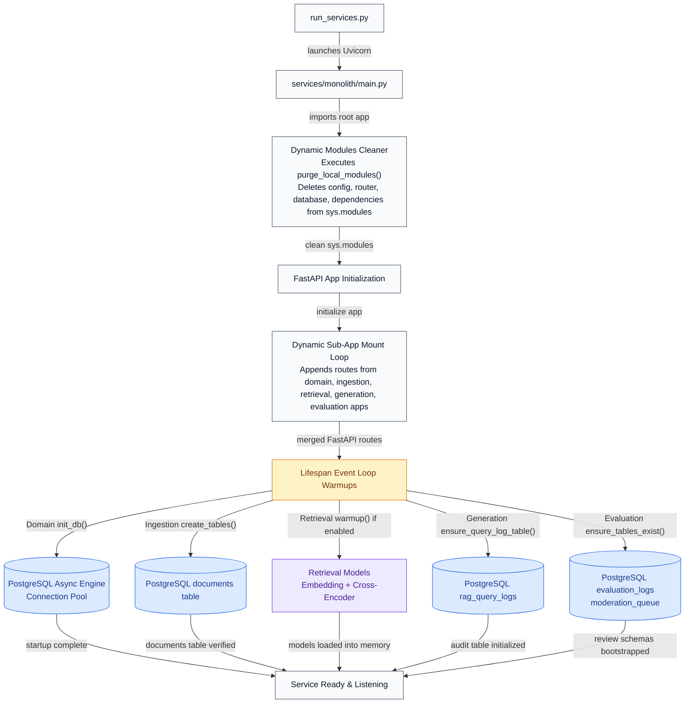
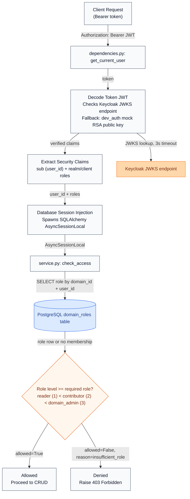
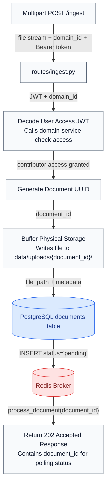
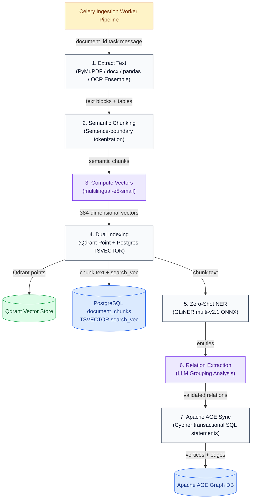
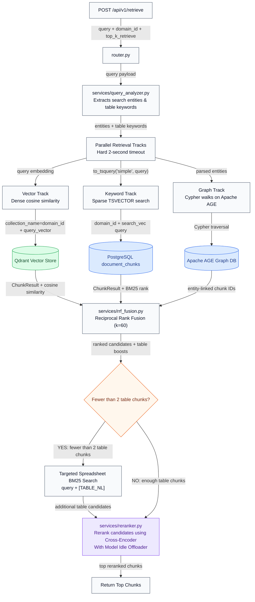
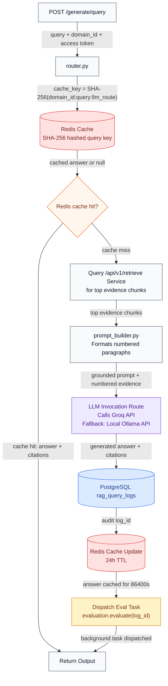
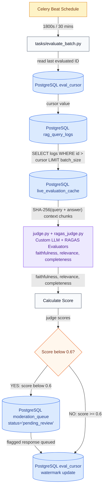
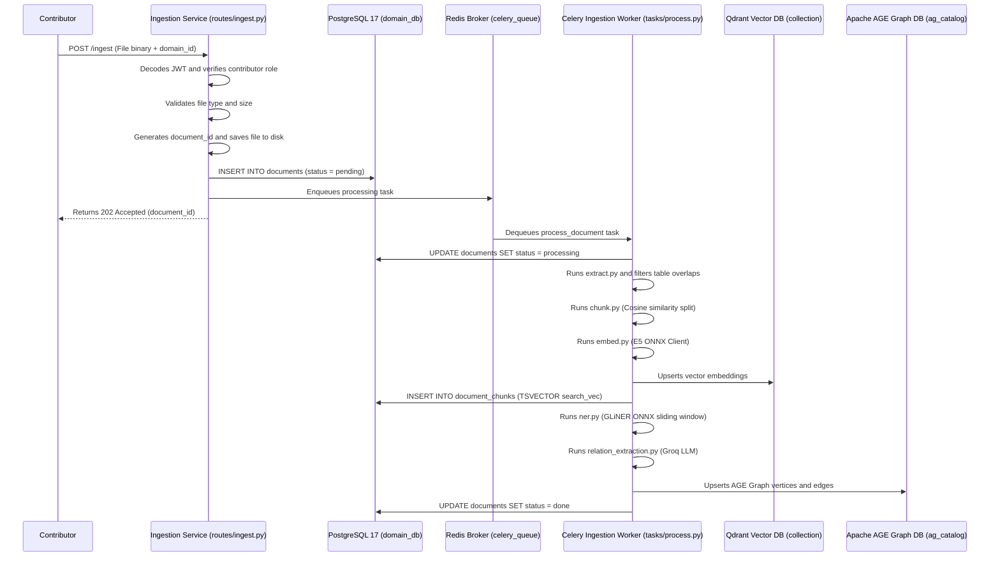
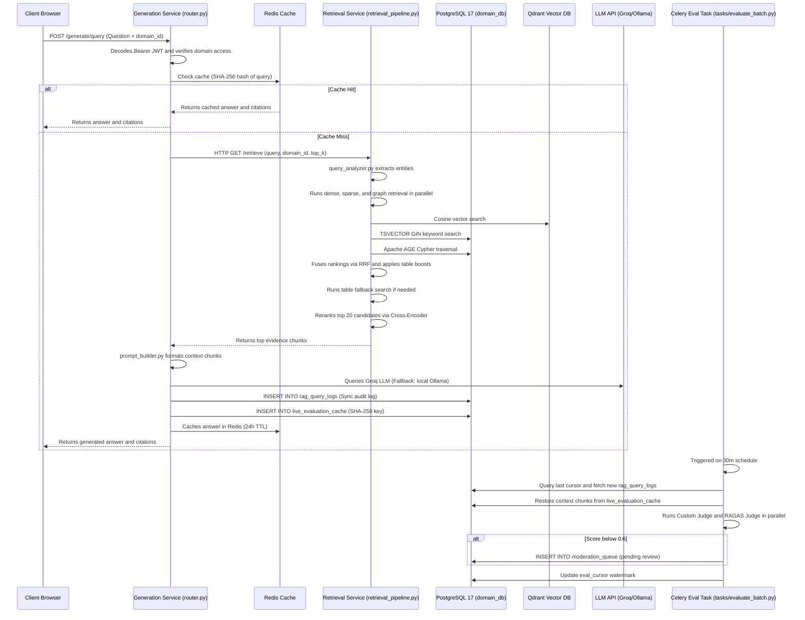

# Comprehensive Developer Onboarding & Architecture Guide

Welcome to the **Chatbot-Fixed-Team2** codebase. This guide is designed to get a new developer fully up to speed on the system’s architecture, technologies, database schemas, internal services, APIs, security mechanisms, pipelines, workflows, and operations.

---

## 1. Project Overview

### What It Does & Problem Solved

**Chatbot-Fixed-Team2** is a multi-user, multi-domain Retrieval-Augmented Generation (RAG) platform. In modern enterprise environments, corporate knowledge is fragmented across scattered formats (PDFs, images, Excel sheets, DOCX documents) and domains (e.g., HR policies, technical support databases, legal contracts). Large Language Models (LLMs) trained on general knowledge lack domain specificity and are prone to hallucinations when answering specialized questions. 

This platform solves these challenges by providing:

1. **Domain Isolation**: Logical segregation of knowledge bases, configuration parameters, and access permissions.

2. **Hybrid Document Ingestion**: A robust document processing pipeline extracting text from both digital formats (.docx, .csv, native PDFs) and scanned materials (PDFs, images) using an advanced OCR ensemble.

3. **Multi-Signal Retrieval**: Combining dense vector embeddings (semantic similarity), sparse database indices (keyword matches), and relational Knowledge Graphs (entity relationships) fused via Reciprocal Rank Fusion (RRF) and reranked using a cross-encoder model.

4. **Grounded Answer Generation**: Formulating prompts containing retrieved document passages as explicit evidence paragraphs, prompting the LLM (Groq cloud or Ollama local) to generate answers backed by citations.

5. **Quality Control & Telemetry**: An automated, continuous "LLM-as-a-judge" evaluation system validating correctness, faithfulness, and completeness, with low scores triggering a human-in-the-loop moderation pipeline.

### Target Users

- **System Administrators**: Manage global system states, create domains, and configure global roles.

- **Domain Managers (Admins)**: Manage domain memberships, assign role-based permissions, and tune domain RAG parameters (chunk sizes, LLM endpoints, retrieval thresholds).

- **Contributors**: Upload documents, run manual ingestion, and query domains.

- **Readers (Consumers)**: Search the knowledge bases, ask questions via the React chat UI, and view sources.

### Architectural Rationale

- **FastAPI Monolith Architecture**: Rather than deploying five separate microservices, the backend components (Domain, Ingestion, Retrieval, Generation, Evaluation) are mounted as sub-apps inside a single FastAPI process. This simplifies deployment, eliminates internal network latency between services, and conserves memory on host systems.

- **PostgreSQL 17 for All SQL & Graphs**: Using PostgreSQL on port `5434` for core relational tables, full-text `TSVECTOR` indices for BM25, and the **Apache AGE** extension for graph traversal allows the entire data tier to run on a single unified database engine.

- **Celery + Redis Task Queue**: Decouples CPU-intensive ML tasks (extracting text, running OCR, computing embeddings, zero-shot entity extraction) from the synchronous API request-response lifecycle.

- **Dual-Layer Caddy Gateway**: Terminates SSL/TLS securely for localhost, handles CORS preflight options, serves the React production bundle, and proxies requests to Keycloak and the FastAPI monolith.

---

## 2. Technology Stack

The platform utilizes a modern, performance-oriented technology stack:

| Component | Technology | Version | Purpose | High-Level Operation | Selection Rationale | Location in Codebase |
| :--- | :--- | :--- | :--- | :--- | :--- | :--- |
| **Language** | Python | `3.11`–`3.13` | Backend runtime | Runs APIs, workers, and ML pipelines | Strong ecosystem for NLP, AI, and asynchronous web servers | [run_services.py](../run_services.py), [services/](../services), [scripts/](../scripts) |
| **Web Framework** | FastAPI | `0.115.6` | Web API Monolith | Asynchronous route definitions, Pydantic data validation | High performance (uvicorn/uvloop), automatic OpenAPI docs | [services/monolith/main.py](../services/monolith/main.py) |
| **Frontend** | React | — | Chat & Dashboard UI | Component-driven UI, state management, API client | Component reusability, quick Vite compilation, rich package ecosystem | [rag-ui/](../rag-ui) |
| **Database (Relational)** | PostgreSQL | `17` (Port `5434`) | Core relational storage | Stores domains, documents, query logs, evaluations | Robust transactions, JSONB support, GIN index capabilities | Connection: [services/domain-service/database.py](../services/domain-service/database.py), Schema: [migrations/init_db.sql](../migrations/init_db.sql) |
| **Graph Database** | Apache AGE | `v1.6.0-rc0` | Knowledge Graph | Cypher queries on PostgreSQL | Integrates Graph DB right inside PostgreSQL, maintaining domain isolation | Read: [services/retrieval-service/services/graph_retriever.py](../services/retrieval-service/services/graph_retriever.py)<br/>Write: [services/worker-service/graph_writer.py](../services/worker-service/graph_writer.py) |
| **Vector DB** | Qdrant | `1.12.1` | Vector similarity | In-memory/embedded cosine search | Fast vector indexing, local embedded mode, doesn't require a separate server process | Factory: [scripts/qdrant_client_factory.py](../scripts/qdrant_client_factory.py)<br/>Search: [services/retrieval-service/services/qdrant_search.py](../services/retrieval-service/services/qdrant_search.py) |
| **Queue & Cache** | Redis | `5.x` | Broker & Cache | Handles Celery tasks and caches LLM query answers | High-speed in-memory operations, natively supports queues and key-value expiry | Cache: [services/generation-service/cache.py](../services/generation-service/cache.py)<br/>Worker: [services/worker-service/worker.py](../services/worker-service/worker.py) |
| **Identity Provider** | Keycloak | `26.5.0` | Authentication / RBAC | Issues signed JWT tokens, manages users | Standard OIDC compliance, robust admin portal, secure user registration | Export: [services/auth/realm-export.json](../services/auth/realm-export.json)<br/>Verify: [services/domain-service/dependencies.py](../services/domain-service/dependencies.py) |
| **Reverse Proxy** | Caddy | `2.x` | HTTPS Gateway & TLS | Terminates TLS, maps routing, serves static UI files | Simple configuration, automated local CA trust, self-contained executable | Config: [Caddyfile](../Caddyfile) |
| **Embeddings** | `multilingual-e5-small` | — | Vectorization | Converts text passages to 384-dimensional dense vectors | Multilingual support, lightweight (loads quickly on CPU), high accuracy | Worker: [services/worker-service/tasks/embed.py](../services/worker-service/tasks/embed.py)<br/>Retrieval: [services/retrieval-service/services/embedding.py](../services/retrieval-service/services/embedding.py) |
| **Cross-Encoder** | `mmarco-mMiniLMv2` | — | Reranking | Evaluates query-passage relevance | Lightweight model optimized for re-scoring candidates | Loaded in [services/retrieval-service/services/reranker.py](../services/retrieval-service/services/reranker.py) |
| **Zero-Shot NER** | `gliner_multi-v2.1` | — | Entity Extraction | Extracts names, projects, roles zero-shot | Zero-shot performance (no model fine-tuning required for new labels) | Loaded in [services/worker-service/ner.py](../services/worker-service/ner.py) |
| **OCR Engines** | PaddleOCR + Surya | — | Text Extraction | Segmented character recognition | PaddleOCR is ultra-fast; Surya serves as a robust transformer fallback | Loader: [services/worker-service/tasks/ocr-service](../services/worker-service/tasks/ocr-service)<br/>Coordination: [services/worker-service/tasks/extract.py](../services/worker-service/tasks/extract.py) |
| **Local LLM** | Ollama | — | Offline Generation | Local LLM hosting | Serves as an offline fallback when Groq keys are absent | Router: [services/generation-service/llm_router.py](../services/generation-service/llm_router.py)<br/>Config: [.env](../.env) |

---

## 3. Project Structure

An annotated directory tree of the workspace root:

```
Chatbot-Fixed-Team2/
├── Caddyfile                          # Configuration for Caddy secure HTTPS proxy and gateway routing
├── docker-compose.yml                 # Launches Keycloak (OIDC) and Traefik in Docker containers
├── requirements.txt                   # Global Python dependencies (SQLAlchemy, Celery, PyTorch, PyMuPDF, etc.)
├── run_services.py                    # Master orchestrator script to launch all host APIs and worker services
├── test_checklist.pdf                 # Reference checklist of tests executed during verification
├── data/                              # Host directories for runtime files (Created on first run)
│   ├── qdrant/                        # Local embedded Qdrant database storage files
│   └── uploads/                       # Physical directory where uploaded document files are stored
├── docs/                              # System documentation and manuals
│   ├── AI_governance_policy.md        # Corporate AI usage and security compliance guidelines
│   ├── UAT_plan.md                    # User Acceptance Testing protocols, configurations, and verification steps
│   ├── go_live_checklist.md           # Deployment validation checklist before launching into production
│   ├── load_test_infra_report.md      # Performance metrics and database indexing logs under Locust load tests
│   ├── runbook.md                     # Operator guide for system start, stop, recovery, and updates
│   ├── user_guide.md                  # User manual for navigating the frontend dashboard
│   ├── md_to_pdf.py                   # Python script converting docs/*.md files to xhtml2pdf output files
│   └── dev_docs/                      # Developer-focused system setup docs
│       ├── TLS_Secrets_RAG_System.md  # Detailed security guidelines, keys, and certificates setup
│       ├── full_execution_guide.md    # Detailed host command configurations (IIS, Caddy, Docker)
│       └── run_guide.md               # Quick setup reference guide for local host deployment
├── infra/                             # Deployment infrastructure configurations
│   ├── nginx.conf                     # Nginx configuration for alternate production proxy setups
│   ├── docker/                        # Production Docker files for base, worker, monolith, and UI containers
│   └── helm/                          # Helm charts for Kubernetes deployments (staging, prod, dev)
├── migrations/                        # SQL migration scripts for relational database bootstrapping
│   ├── clear_db.sql                   # SQL commands to completely drop all database schemas
│   ├── init_db.sql                    # Initial SQL relational table schemas
│   ├── setup_all.sql                  # Combined database setup script
│   └── sprint3_foundation.sql         # Apache AGE graph database and Cypher index seeding SQL statements
├── models/                            # Directory containing offline model weights
│   ├── e5-small/                      # Local cache of the multilingual-e5-small embedding model
│   └── gliner_multi-v2.1-onnx/        # Local cache of the quantized GLiNER multi-v2.1 model in ONNX format
├── monitoring/                        # Telemetry and dashboard definitions
│   ├── docker-compose.monitoring.yml  # Docker Compose launching Prometheus, Grafana, and Alertmanager
│   ├── prometheus/                    # Alerting rules (alerts.yaml) and target scrape configurations
│   ├── grafana/                       # Dashboards definitions for service health and retrieval pipeline
│   └── scripts/                       # Performance testing scripts
│       ├── baseline.sh                # Telemetry baseline capturing script (executed in bash/WSL2)
│       └── tuning.sh                  # Diagnostics script to apply indexes and alter database parameters
├── rag-ui/                            # React + TypeScript + Vite frontend
│   ├── tailwind.config.js             # Tailwind CSS layout utility variables
│   ├── vite.config.ts                 # Dev server ports, SSL proxies, and paths configuration
│   ├── package.json                   # UI package dependencies
│   └── src/                           # UI React source code
│       ├── App.tsx                    # Main UI entry point, router configurations, and authentication checks
│       ├── main.tsx                   # Renders React DOM onto index.html
│       ├── index.css                  # Core CSS and design tokens
│       ├── pages/                     # Application route views (ChatPage, DocumentsPage, QualityPage, etc.)
│       └── store/                     # Context API and global UI state hooks
├── scripts/                           # Auxiliary database and project management scripts
│   ├── clear_database.py              # Asynchronously drops all relational tables in PostgreSQL
│   ├── delete_chunks.py               # Deletes Qdrant collections and PostgreSQL document chunks
│   ├── download_onnx.py               # Downloader utility for GLiNER and HuggingFace models
│   ├── run_migration.py               # Reads and executes setup_all.sql and graph-based SQL configurations
│   └── secrets_check.py               # Verifies entropy strength and safety of .env configuration parameters
├── services/                          # Source code of the core system monolith and workers
│   ├── auth/                          # Keycloak realm configuration export files
│   ├── shared/                        # Shared libraries (Prometheus gauges, database utilities)
│   ├── worker-service/                # Celery background workers and extraction tasks
│   │   ├── worker.py                  # Entry point for Celery ingestion tasks and worker configurations
│   │   ├── tasks/                     # Extraction pipeline files
│   │   │   ├── chunk.py               # Semantic chunking parser using sentence boundary layouts
│   │   │   ├── extract.py             # Router coordinating python-docx, pandas, and OCR engines
│   │   │   ├── embed.py               # Transformer model embedding wrapper
│   │   │   ├── index.py               # Idempotent indexer for PostgreSQL and Qdrant points
│   │   │   └── ocr-service/           # Text extraction from images (PaddleOCR + Surya)
│   │   └── ner.py                     # GLiNER zero-shot entity extraction
│   └── monolith/                      # Unified FastAPI deployment wrapper
│       └── main.py                    # Mounts sub-services as sub-apps, starts lifetime runners, and routes
├── tools/                             # Location for portable executables (Caddy, Redis, Keycloak)
└── tests/                             # Integration tests directory
    ├── conftest.py                    # Pytest fixtures, mock users database seeding, and cleanups
    ├── test_rbac.py                   # Role-Based Access Control integration test cases
    └── load_test.py                   # Locust load testing scripts simulating user queries
```

### Entry Points

- **Backend API**: [services/monolith/main.py](../services/monolith/main.py) is loaded via Uvicorn. It mounts the domain, ingestion, retrieval, generation, and evaluation sub-apps.

- **Background Worker**: [services/worker-service/worker.py](../services/worker-service/worker.py) starts the Celery worker pulling jobs from the `ingestion` queue.

- **Frontend App**: [rag-ui/src/main.tsx](../rag-ui/src/main.tsx) is parsed by Vite to render the React tree onto `rag-ui/index.html`.

- **Gateway**: Caddy reads [Caddyfile](../Caddyfile) to bind external interfaces to internal ports.

---

## 4. Architecture & System Design

### System Architecture

The diagram below shows the architecture of the system:

```mermaid
flowchart LR
    Browser["Client Browser<br/>(React Web Application UI)"]
    Caddy["Caddy SSL/TLS Proxy"]
    Keycloak["Keycloak Container<br/>(User Identity/OIDC)<br/>Port: 8180"]
    Monolith["FastAPI Monolith<br/>(All FastAPI Sub-Services)"]
    Redis[("Redis Broker<br/>Port: 6379")]
    Qdrant[("Qdrant Vector Store<br/>Embedded")]
    Postgres[("PostgreSQL 17<br/>Port: 5434")]
    Worker["Celery Ingestion<br/>Background Worker"]
    Process["Ingestion Tasks<br/>tasks.process"]
    Extract["extract.py<br/>(PyMuPDF / DOCX / CSV / OCR)"]
    Chunk["chunk.py<br/>(Sentence-boundary split)"]
    Embed["embed.py<br/>(multilingual-e5-small)"]
    Index["index.py<br/>(Qdrant Point + Postgres TSVECTOR)"]
    Ner["ner.py<br/>(GLiNER multi-v2.1 ONNX)"]
    Relation["relation_extraction.py<br/>(Groq/Ollama LLM)"]
    GraphWriter["graph_writer.py<br/>(Apache AGE Cypher statement writer)"]

    Browser -->|"HTTPS: Port 3001 UI / 8000 API"| Caddy
    Caddy -->|"HTTPS:8443"| Keycloak
    Caddy -->|"HTTP:8001 Monolith routes"| Monolith
    Keycloak <-->|"Verify OIDC/JWT"| Monolith
    Monolith -->|"Publish Celery job"| Redis
    Monolith -->|"Vector query"| Qdrant
    Monolith -->|"SQL BM25"| Postgres
    Redis -->|"Pulls tasks"| Worker
    Worker -->|"Saves chunks, NER entities, Cypher graphs"| Postgres
    Worker -->|"Runs task pipeline"| Process
    Process -->|"file_path"| Extract
    Extract -->|"text blocks + tables"| Chunk
    Chunk -->|"document chunks"| Embed
    Embed -->|"384-dimensional vectors"| Index
    Index -->|"Qdrant points"| Qdrant
    Index -->|"TSVECTOR chunks"| Postgres
    Chunk -->|"chunk text"| Ner
    Ner -->|"entities"| Relation
    Relation -->|"validated relations"| GraphWriter
    GraphWriter -->|"Apache AGE Cypher statements"| Postgres

    classDef service fill:#f8fafc,stroke:#475569,color:#0f172a;
    classDef caddy fill:#ccfbf1,stroke:#0f766e,color:#134e4a;
    classDef keycloak fill:#fed7aa,stroke:#f97316,color:#7c2d12;
    classDef postgres fill:#dbeafe,stroke:#2563eb,color:#1e3a8a;
    classDef redis fill:#fee2e2,stroke:#dc2626,color:#7f1d1d;
    classDef qdrant fill:#dcfce7,stroke:#16a34a,color:#14532d;
    classDef llm fill:#ede9fe,stroke:#7c3aed,color:#4c1d95;
    classDef worker fill:#fef3c7,stroke:#d97706,color:#78350f;

    class Browser,Monolith,Process,Extract,Chunk,Ner,GraphWriter service;
    class Caddy caddy;
    class Keycloak keycloak;
    class Postgres postgres;
    class Redis redis;
    class Qdrant qdrant;
    class Relation,Embed llm;
    class Worker,Index worker;
```



### Core Design Patterns

- **Monolith-Sub-App Pattern**: FastAPI apps are written independently (each with its own `config.py`, `router.py`, and domain models) and mounted onto a root monolith in [services/monolith/main.py](../services/monolith/main.py). This isolates service logic during code development while allowing them to execute in a single shared process during deployment.

- **Asynchronous Task Offloading**: Web endpoints that take more than 200ms (such as parsing large documents or executing OCR pipelines) immediately return a `202 Accepted` status along with a `document_id`. The actual work is dispatched to Celery.

- **Idempotent Ingestion Pattern**: The worker-service uses database upserts (`ON CONFLICT DO UPDATE`) and Qdrant overrides. Re-running the ingestion task for an existing document updates its chunks without duplicating them.

- **Database-Level Isolation**: Multi-tenancy is maintained by structuring Vector collections (Qdrant) and full-text chunks (PostgreSQL) using `domain_id` as the primary filtering key.

---

## 5. Services & Components Breakdown

### 5.1 Caddy Gateway (`Caddyfile`)

* **What it does and why it exists**: Caddy serves as the central reverse proxy and SSL/TLS gateway for the entire local environment. Without it, the browser client would fail due to CORS (Cross-Origin Resource Sharing) restrictions when trying to request endpoints from Keycloak (`:8180`) and the Monolith (`:8001`) simultaneously. Caddy acts as the single origin point for all static UI files and HTTP routes.

* **Code-level walkthrough**:

  - **Static Assets Host (`https://localhost:{$UI_PORT}`)**: Caddy mounts the directory `rag-ui/dist` as its root folder using `root * rag-ui/dist` and enables the `file_server` middleware. To support React Router SPA (Single Page Application) client-side routes, Caddy implements `try_files {path} /index.html` which catches any URL paths not physically present on disk and redirects them internally to serve the main `index.html` entry point.

  - **API Gateway (`https://localhost:{$GATEWAY_PORT}`)**: 

    - Caddy injects a set of custom CORS and security response headers for all requests: `Access-Control-Allow-Origin "https://localhost:{$UI_PORT}"`, `Access-Control-Allow-Headers "Authorization, Content-Type, X-Internal-Key"`, and `Access-Control-Allow-Methods "GET, POST, PUT, PATCH, DELETE, OPTIONS"`. It also sets security parameters like `X-Content-Type-Options "nosniff"` and `X-Frame-Options "DENY"`.

    - Handles CORS preflight requests by matching options requests: `@options method OPTIONS` -> `respond @options 204` to prevent API proxying for preflight requests.

    - Resolves `/internal/*` routes by applying a loopback filter: `@not_loopback not remote_ip 127.0.0.1 ::1` -> `abort @not_loopback`. If the request is from a loopback address, Caddy executes `reverse_proxy localhost:{$DOMAIN_SERVICE_PORT}`.

    - All other request paths fall through to be proxied directly to the monolith gateway at `localhost:{$DOMAIN_SERVICE_PORT}` (the domain service port is mapped to the FastAPI monolith entry point).

  - **Keycloak Proxy (`https://localhost:{$KEYCLOAK_GATEWAY_PORT}`)**: Exposes Keycloak's login console to the outer HTTPS port by proxing to the Keycloak container running on `localhost:{$KEYCLOAK_PORT}`. It injects upstream headers: `header_up Host {host}`, `header_up X-Real-IP {remote_host}`, and `header_up X-Forwarded-Proto https` to ensure Keycloak detects the secure proxy boundary and operates in OIDC-compliant secure cookies mode.

* **Inputs and outputs**:

  - **Inputs**: Incoming TCP packets on ports UI_PORT, GATEWAY_PORT, and KEYCLOAK_GATEWAY_PORT from the client browser.

  - **Outputs**: Proxied HTTP request payloads routed to upstream services (FastAPI on DOMAIN_SERVICE_PORT, Keycloak on KEYCLOAK_PORT), or static text/binary assets (JS, HTML, CSS) returned to the browser.

* **Why this and not that**:

  - **Caddy over Nginx**: Caddy automatically generates, trusts, and rotates local self-signed SSL/TLS certificates and binds them to the Windows Local Trust Store on launch. Setting this up under Nginx requires running external `mkcert` commands, manual certificate installation, and complex config paths.

  - **`abort` for non-loopback `/internal/*`**: Aborting non-loopback requests at the gateway level is a defense-in-depth measure. Unlike returning `403 Forbidden` (which requires downstream web server resources to run), Caddy's `abort` immediately closes the TCP connection, preventing any network scan or external actor from probing internal services or testing vulnerabilities in downstream dependencies.

* **Edge cases and failure branches**:

  - **Monolith / Keycloak Down**: If target backend services are offline, Caddy returns a `502 Bad Gateway` to the browser client.

  - **Malformed Client Requests / Large Payloads**: If a request exceeds standard buffer sizes or violates HTTP protocols, Caddy's internal Go HTTP server drops the connection and logs the event to `logs/caddy-api.log`.

  - **Port Conflict on Startup**: If another process is already listening on UI_PORT, GATEWAY_PORT, or KEYCLOAK_GATEWAY_PORT, Caddy will fail to launch and print a binding error to standard error.

* **Numbers and why those numbers**:

  - `admin localhost:2019`: Configures Caddy's administrative API to listen on port `2019` to allow dynamic config reloading without dropping existing client connections.

  - `respond @options 204`: Returns HTTP status `204 No Content` (the standard browser-expected response code for successful CORS preflight requests) immediately.

  - `127.0.0.1` and `::1`: Dual IP filters checking both IPv4 and IPv6 loopback addresses to ensure internal routes can only be hit from the local host machine.

* **Questions you might get asked**:

  1. *How does Caddy handle SSL certificates locally on Windows without browser warnings?*

     **Answer**: Caddy has a built-in local Certificate Authority (CA). On startup, it generates a root certificate, uses Windows API commands to insert it into the Windows System Trust Store, and dynamically issues site certificates for `localhost`.

  2. *What happens if an external attacker tries to access `/internal/check-access`?*

     **Answer**: Caddy's `@not_loopback not remote_ip 127.0.0.1 ::1` condition evaluates to true, triggering `abort`, which silently terminates the TCP connection at the proxy level without sending any HTTP headers or status code.

  3. *Why does the Keycloak proxy require `header_up X-Forwarded-Proto https`?*

     **Answer**: Keycloak is configured with SSL required for external access. By default, it rejects cookies and tokens over HTTP. This header forces Keycloak to recognize that the outer connection terminated securely at Caddy, enabling standard secure session cookies.

---

### 5.2 Keycloak / Authentication Service (`services/auth`)

* **What it does and why it exists**: Keycloak manages user identities, login sessions, and domain access roles. Without it, the application would lack secure user validation and would have to manage sensitive user passwords and OIDC sessions manually.

* **Code-level walkthrough**:

  - **OIDC Authorization Flow**: When a user clicks "Login", the React application redirects the browser to Keycloak's authorization endpoint: `https://localhost:8443/realms/rag-system/protocol/openid-connect/auth`.

  - **Authentication & Code Generation**: Keycloak prompts the user for credentials, validates them against its local database tables (`keycloak_db` on PostgreSQL), and redirects back to the React UI callback with an authorization code.

  - **Token Exchange**: The React UI exchanges this authorization code for three JSON Web Tokens (JWTs): an ID token, an Access Token, and a Refresh Token via `.../protocol/openid-connect/token`.

  - **JWT Decoded Structure**: Keycloak signs the Access Token using RS256. The token payload contains:

    - `sub`: Unique OIDC user ID (stored in the monolith's `users` table).

    - `preferred_username` and `email`: User details.

    - `resource_access`: Client-specific roles (e.g. `system_admin`, `domain_admin`).

* **Inputs and outputs**:

  - **Inputs**: User credentials, Client ID, Client Secrets (where required), OIDC authorization codes.

  - **Outputs**: Access Tokens (JWT), Refresh Tokens, and user profile information payloads.

* **Why this and not that**:

  - **Keycloak OIDC vs. Custom Auth Service**: A custom authentication service requires writing secure password hashing (bcrypt/Argon2), session invalidation, token signing, and token refresh mechanisms, which are highly vulnerable to design flaws. Keycloak provides a battle-tested OIDC compliance layer, session expiration controls, and single-sign-on (SSO) out of the box.

* **Edge cases and failure branches**:

  - **Keycloak Service Down**: If Keycloak is offline, the domain service falls back to **Dev Auth Mode** by using a mock private RSA key pair generated by `dev_auth.py` to sign and verify mock JWTs.

  - **Invalid or Expired JWT**: If a client sends an expired token, the `jwt.decode` function in `dependencies.py` raises an `ExpiredSignatureError` which is caught in `_decode_token()` and converted into a `401 Unauthorized` HTTP exception, forcing the React UI to use its Refresh Token to acquire a new Access Token.

  - **Audience Mismatch**: Keycloak puts the client ID inside the `azp` (Authorized Party) claim instead of `aud` (Audience). The decoder passes `options={"verify_aud": False}` to prevent validation crashes.

* **Numbers and why those numbers**:

  - Port `8180` (HTTP) inside the Docker container, exposed publicly as `8443` via Caddy.

  - JWT token lifetimes (typically 5 minutes for Access Tokens, 30 minutes for Refresh Tokens) are set to balance security (minimizing the utility of stolen tokens) with usability (minimizing token refresh requests).

* **Questions you might get asked**:

  1. *How does the backend verify Keycloak JWTs without calling Keycloak for every API request?*

     **Answer**: The domain service retrieves Keycloak's JSON Web Key Set (JWKS) public key once (using `_get_public_key()` which hits `settings.KEYCLOAK_REALM_URL` with a 3-second timeout and caches it using `@lru_cache`). Using this public key, it validates JWT signatures locally in CPU memory.

  2. *What is the purpose of the Dev Auth Mode fallback?*

     **Answer**: If Keycloak is offline, the system falls back to using `dev_auth.py` which creates a temporary RSA key pair. This allows developers to run tests and make authenticated requests locally without running a Keycloak Docker container.

  3. *Why does the JWT decoder use `verify_aud: false`?*

     **Answer**: Keycloak designates the target client ID as the Authorized Party (`azp`) claim instead of the Audience (`aud`) claim. Disabling strict audience verification prevents JWT decoding errors while ensuring the token is still securely verified against Keycloak's public signature.

---

### 5.3 Monolith Service (`services/monolith`)

* **What it does and why it exists**: Aggregates and runs the individual sub-applications (`domain-service`, `ingestion-service`, `retrieval-service`, `generation-service`, `evaluation-service`) within a single Python process. Without it, developers would have to deploy and manage 5 separate services, leading to increased container overhead and internal network delays.

* **Code-level walkthrough**:

  - **Module Isolation Cleanup (`purge_local_modules()`)**:

    When mounting multiple sub-apps in a single Python process, each sub-app has its own local `config.py` or `router.py`. Python caches imported modules in `sys.modules`. To prevent imports from colliding, `purge_local_modules()` iterates through the keys of `sys.modules` and deletes keys named `"config"`, `"router"`, `"dependencies"`, `"database"`, `"models"`, `"schemas"`, `"service"`, or `"routes"`.

  - **Dynamic Sub-App Loading (`load_service_app(service_name, dir_name)`)**:

    1. Inserts the sub-app directory (e.g. `services/domain-service`) at the front of `sys.path` (`sys.path.insert(0, ...)`).

    2. Calls `purge_local_modules()` to evict cached module instances.

    3. Loads the sub-app's entry point (`main.py`) using `importlib.util.spec_from_file_location()`.

    4. Retrieves `module.app` and removes the sub-app directory from `sys.path`.

  - **Flat Route Merging**:

    The main FastAPI app loops over the loaded sub-apps and appends their endpoints directly to its own route list: `app.routes.append(route)`. It checks `route.path` to exclude duplicate default paths like `/openapi.json`, `/docs`, `/redoc`, `/health`, and `/metrics`.

  - **Unified Lifespan Event Loop (`monolith_lifespan()`)**:

    - **Startup**:

      1. Sets `app.state.models_ready = False`.

      2. Initializes PostgreSQL connections for `domain-service` via `init_db()`.

      3. Bootstraps document metadata schemas via Ingestion's `create_tables()`.

      4. Warmups models: If `WARMUP_ON_START` is True, it runs `embedding.warmup()` and `reranker.warmup()` in parallel threads, loading tokenizer configurations and weights.

      5. Sets up audit logs via Generation's `ensure_query_log_table()`.

      6. Prepares review schemas via Evaluation's `ensure_tables_exist()`.

      7. Sets `app.state.models_ready = True`.

    - **Shutdown**: Gracefully closes asynchronous connection pools: `cache.close()`, `bm25_search.close()`, `qdrant_search.close()`, `close_router_resources()`, and domain database engines (`dispose_engine()`).

* **Monolith Pipeline Flowchart**:



---

### 5.4 Domain Service (`services/domain-service`)

* **What it does and why it exists**: Manages multi-tenant configuration, database sessions, domain config parameters, domain roles, and global system user directory. Without it, the application could not enforce logical isolation between domains.

* **Code-level walkthrough**:

  - **`get_db()` (`dependencies.py:L19-27`)**: Spawns a database session using `AsyncSessionLocal()`. Yields the session to the route handler. Upon successful request completion, it commits all changes (`await session.commit()`). If any exception occurs during the request, it rolls back the transaction (`await session.rollback()`) and re-raises the exception, ensuring database transaction safety.

  - **`_decode_token()` (`dependencies.py:L61-102`)**: Fetches Keycloak's public key (retrieved via JWKS endpoint with 3s timeout and cached in memory). Loops through `_issuer_candidates()` to verify the token signature using PyJWT/python-jose under `RS256` algorithm. It passes `options={"verify_aud": False}` because Keycloak places the client ID inside the Authorized Party (`azp`) claim instead of the Audience (`aud`) claim. If Keycloak is offline, it falls back to checking signature validity against a mock public key generated in-process by `dev_auth.py`. Raises `401 Unauthorized` on verification failure.

  - **`get_current_user()` (`dependencies.py:L116-135`)**: Invokes `_decode_token()`, extracts claims: `sub` (maps to `user_id`), `preferred_username`, and `email`. It extracts user roles using `_extract_roles()` (merging client-specific and realm-wide roles). Returns an authenticated user dictionary, flagging if the user carries the global `system_admin` role.

  - **`check_access()` (`service.py:L310-336`)**: Checks system admin (if true, bypasses checks and returns `allowed=True`). Queries the database for the domain. If domain status is `archived`, it returns `allowed=False, reason="domain_archived"`. Otherwise, it queries `domain_roles` for the user's role on that domain. If no membership exists, it returns `allowed=False, reason="not_a_member"`. Checks if the role meets the required permission level using the `ROLE_LEVEL` precedence dictionary (`reader`: 1, `contributor`: 2, `domain_admin`: 3). If `ROLE_LEVEL[role] >= ROLE_LEVEL[required_role]`, it returns `allowed=True`, else `allowed=False, reason="insufficient_role"`.

  - **`delete_document()` (`service.py:L369-441`)**: 

    1. Verifies the user has at least `contributor` access to the domain.

    2. Queries PostgreSQL `documents` table to retrieve document metadata (e.g. `file_path`). If not found, raises a `404 Not Found` error.

    3. Deletes all searchable segments for the document from the `document_chunks` table.

    4. Deletes the core metadata row from the `documents` table.

    5. Connects to Qdrant via the synchronized client and deletes all vectors matching the document ID using `PointSelector` filters (wrapped in a try-except block to make it best-effort).

    6. Deletes the physical file from disk using `os.remove()` and removes the parent directory if empty.

* **Domain Service Pipeline Flowchart**:



* **Inputs and outputs**:

  - **Inputs**: HTTP authorization Bearer headers containing Keycloak JWTs, domain UUID parameters, and config JSON payloads.

  - **Outputs**: Domain configuration settings, domain membership records, or boolean route access permissions.

* **Why this and not that**:

  - **Automatic Commit/Rollback in `get_db` Dependency**: Centralizing transaction lifecycle management inside the dependency context manager ensures database sessions are closed and rolled back on error. This avoids manual session management in router controllers and prevents database connection pools from being exhausted.

  - **Global System Admin Bypass**: Allowing global `system_admin` users to bypass domain membership checks enables system-wide auditing and configuration without registering admins as members of every domain.

* **Edge cases and failure branches**:

  - **Concurrent Writes on Same Domain Name**: Handled by database constraint: `name` on `Domain` model has a `UNIQUE` index. Simultaneous requests attempting to insert the same domain name will trigger a `psycopg2.errors.UniqueViolation` database exception. The transaction is rolled back, and a `409 Conflict` HTTP error is returned to the client.

  - **Token Expiry Mid-Request**: If the JWT signature expires between request entry and db transaction execution, `_decode_token()` immediately throws `401 Unauthorized` before any CRUD code runs, preventing unauthorized database transactions.

  - **Qdrant Down during Document Deletion**: Deletion is isolated: `delete_document` wraps the Qdrant client call in a `try/except` block. If Qdrant is offline, it logs a warning but proceeds to complete the PostgreSQL transaction and disk file deletion. PostgreSQL is the absolute source of truth; orphaned vectors in Qdrant are ignored during normal operations.

* **Numbers and why those numbers**:

  - `ROLE_LEVEL` mappings (`reader`: 1, `contributor`: 2, `domain_admin`: 3): Standardizes role precedence as integers, enabling single-line permission evaluations: `ROLE_LEVEL[role] >= ROLE_LEVEL[required_role]`.

  - `DEFAULT_CHUNK_SIZE = 512` and `DEFAULT_CHUNK_OVERLAP = 64`: standard parameters for RAG segmentation.

  - `JWKS client request timeout = 3`: prevents blocking Uvicorn startup indefinitely if Keycloak is slow or offline.

* **Questions you might get asked**:

  1. *What happens to domain configuration parameters when a domain is archived?*

     **Answer**: The domain's config row in `domain_configs` remains intact, but the domain status is set to `archived` in the `domains` table. `check_access()` rejects any requests to query or modify the domain, effectively blocking all operational paths.

  2. *How is multi-tenant isolation enforced in database queries?*

     **Answer**: Every document metadata query, chunk retrieval, and vector search filter explicitly requires a `domain_id` parameter. `check_access` verifies the user has permissions on that `domain_id` before executing the actual database operations.

  3. *Why does the database session use `expire_on_commit=False`?*

     **Answer**: In async SQLAlchemy, accessing attributes on committed model objects after a session commit triggers lazy loading. Lazy loading is not supported asynchronously by default, causing a `MissingGreenlet` error. Setting `expire_on_commit=False` keeps the loaded attributes in memory after commit.

---

### 5.5 Ingestion Service (`services/ingestion-service`)

* **What it does and why it exists**: Receives file uploads, saves files to disk, seeds database document status, and dispatches processing tasks. Without it, direct synchronous uploads would freeze backend workers.

* **Code-level walkthrough**:

  - **`ingest_document()` (`routes/ingest.py:L50-118`)**:

    1. Checks filename extension: extracts suffix and checks if it is in `{e.value for e in FileTypeEnum}` (supported: `.pdf`, `.docx`, `.doc`, `.xlsx`, `.xls`, `.csv`, `.png`, `.jpg`, `.jpeg`). Raises `400 Bad Request` if unsupported.

    2. Validates file size: reads file bytes with `await file.read()`. If `len(file_bytes) > settings.max_size_mb * 1024 * 1024` (default 50MB), raises `400 Bad Request`.

    3. Verifies domain access: calls `check_domain_access()` dependency, which hits the internal domain service. User must have at least `contributor` role. If unauthorized, raises `403 Forbidden`.

    4. Generates UUID: `document_id = str(uuid.uuid4())`.

    5. Saves file to disk: calls `save_file()` in `storage.py`, which writes to `data/uploads/{document_id}/{filename}` and returns the path.

    6. Seeding metadata: calls `insert_document()` to insert a row in the `documents` table with status `pending`.

    7. Dispatches task: calls `_enqueue_processing(document_id)`.

       - If `SYNC_INGESTION` env is true: spawns a local subprocess running `tasks.run_document` and returns its PID.

       - Otherwise: calls `celery_app.send_task(TaskEnum.PROCESS_DOCUMENT, args=[document_id], queue=QueueEnum.INGESTION)` and returns Celery task ID.

       - Updates document row with the `task_id` (PID or Celery ID) and returns `202 Accepted` with `document_id`.

  - **`cancel_processing()` (`routes/ingest.py:L141-179`)**:

    1. Fetches document metadata. If not found, raises `404 Not Found`.

    2. Verifies user has `contributor` access on the domain.

    3. Validates document status: must be `pending` or `processing`. If `done` or `failed`, raises `400 Bad Request` (cannot cancel completed jobs).

    4. Terminates task:

       - Under `SYNC_INGESTION`: calls `os.kill(int(task_id), signal.SIGTERM)`.

       - Under Celery: calls `celery_app.control.revoke(task_id, terminate=True, signal='SIGTERM')`.

    5. Updates status to `cancelled` in the database.

* **Ingestion Service Pipeline Flowchart**:



* **Inputs and outputs**:

  - **Inputs**: Multipart HTTP requests containing file streams, domain IDs, and user JWT headers.

  - **Outputs**: JSON payloads containing `document_id` and document processing status (`pending`).

* **Why this and not that**:

  - **Asynchronous Ingestion (202 Accepted)**: Offloading text parsing, OCR, vector embedding, and graph ingestion to background workers prevents API thread blocking and browser request timeouts.

  - **Local Filesystem Storage**: Storing files on disk at `data/uploads/` instead of saving them as raw database blobs prevents PostgreSQL table bloat, keeps database backups lightweight, and allows backend workers to read files directly via standard OS file system APIs.

* **Edge cases and failure branches**:

  - **Duplicate Document Upload**: If a user uploads the exact same file twice, a new `document_id` UUID is generated. The file is saved in a separate subdirectory under `data/uploads/` and processed independently, preventing overwrite conflicts.

  - **Invalid/Corrupt File Upload**: If the upload is a corrupted PDF or empty document, the Ingestion service saves it normally, but the background Celery worker fails during text extraction, catches the error, updates the document status to `failed`, and records the traceback in the `error_msg` column.

  - **Token Expiry during Upload**: The JWT Bearer token is verified when the request enters the endpoint. If the upload of a large file takes longer than the remaining token lifetime, the request will fail at entry with `401 Unauthorized`.

* **Numbers and why those numbers**:

  - `max_size_mb = 50`: Upper bound size limit for uploaded files. Prevents malicious users from uploading giant files to trigger disk space exhaustion or heap OOMs during worker processing.

  - `SYNC_INGESTION`: Environment toggle. Set to True in test suites to process documents synchronously in-process, enabling reliable assertions without sleeping or polling Celery queues.

* **Questions you might get asked**:

  1. *What happens to the background task when a user cancels an ingestion?*

     **Answer**: The endpoint calls `revoke(task_id, terminate=True, signal='SIGTERM')`. This sends a SIGTERM signal directly to the Celery worker thread executing that task ID, terminating it immediately, and updates the document status to `cancelled`.

  2. *How does the system ensure files are securely stored on disk?*

     **Answer**: The `save_file()` utility sanitizes the filename using Path operations and places it under a dedicated UUID directory `data/uploads/{document_id}/`. This prevents path traversal attacks (e.g. uploading a file named `../../etc/passwd`).

  3. *Why does the Ingestion service use Celery and not standard FastAPI `BackgroundTasks`?*

     **Answer**: FastAPI `BackgroundTasks` run in the same event loop/process as the API server. Heavy CPU operations (like PaddleOCR or transformer inference) would block the API process, making the server unresponsive. Celery runs tasks in a completely separate process pool.

---

### 5.6 Background Ingestion Worker (`services/worker-service`)

* **What it does and why it exists**: Processes uploaded documents asynchronously, segments text, calculates vectors, performs NER, extracts relations, and updates vector, keyword, and graph indexes. Without it, raw files could not be converted into structured context chunks for retrieval.

* **Code-level walkthrough**:

  - **Task Dequeuing & Orchestration (`process.py`)**:

    - Listens on Redis queues. Dequeues `process_document(document_id)` tasks.

    - Sets document status to `processing` in PostgreSQL and resets progress metrics.

    - Invokes `extract_text_and_tables(file_path)` to begin document parsing.

    - Runs text through `chunk_document_segments()`, `embed_document_chunks()`, and `index_document_data()`.

    - Invokes `extract_entities_and_relations()` and `write_to_age_graph()` for knowledge graph construction.

    - Updates document status to `done` in PostgreSQL upon completion.

  - **Text & Table Extraction (`tasks/extract.py` & `ocr_service`)**:

    - **PDF Native Parsing**: Uses `fitz.open(file_path)`. Loops through pages, calls `page.get_text("blocks")` which returns a list of bounding boxes and block text.

    - **Table Extraction (Camelot)**: Instantiates `camelot.read_pdf(file_path, pages=str(page_num), flavor='lattice')` (for grids/borders) or falls back to `flavor='stream'` (for white-space aligned tables). Spawns table extraction.

    - **Deduplication / Bounding Box Overlap**: For each extracted table, calculates its bounding box normalized coordinates. Iterates through native text blocks. If a text block's bounding box area overlaps with any table's bounding box area by more than 30% (`overlap_ratio > 0.3`), that text block is filtered out to prevent duplicating table numbers inside the plain text stream.

    - **OCR Fallback Pipeline**:

      - If native text extraction returns no blocks, or if processing an image file (.png, .jpg), it runs the OCR pipeline:

      - Calls `detect_language(page_image)` which passes page image to a CLIP-based classifier to predict Arabic vs English.

      - Calls `PaddleOCR(lang=detected_lang)` with the detected language to avoid multi-language search latency.

      - If PaddleOCR character detection confidence falls below `0.85`, it falls back to loading and running `Surya` layout/OCR model.

      - Sorts tables and text blocks vertically by y-coordinate to preserve reading order, wrapping tables in `[TABLE_MD] {markdown_table} [/TABLE_MD]`.

      - Calls `gc.collect()` and `torch.cuda.empty_cache()` at the end of each page extraction to free memory.

  - **Semantic Sentence Chunking (`tasks/chunk.py`)**:

    - Splits text into sentence tokens using a regex boundaries classifier with custom rules to prevent splitting on Arabic punctuation/abbreviations (like `د.`, `أ.`).

    - Uses local embedding model (quantized `multilingual-e5-small` ONNX client) to compute sentence embeddings for all sentences.

    - Iterates through sentences and computes cosine similarity between adjacent sentence embeddings: `similarity = dot_product(emb_i, emb_i+1) / (norm(emb_i) * norm(emb_i+1))`.

    - If `similarity < 0.70`, it marks a segment split.

    - Respects guard limits: `min_sentences = 2` (never splits if a chunk has only 1 sentence) and `max_sentences = 30` (forces a split even if similarity is high to prevent giant chunks).

    - Table preservation: checks if sentence contains table markers (`[TABLE_MD]`). If so, table chunks are never split semantically; they are isolated as standalone chunks with `[TABLE_NL]` markers.

  - **Embedding Generation (`tasks/embed.py` & `onnx_client.py`)**:

    - Uses ONNX Runtime quantized `multilingual-e5-small` with model pre-loading on startup (warmup).

    - Pads input token sequences to the model's max sequence length (512 tokens).

    - Runs ONNX model inference to output token embeddings.

    - Applies **Mean Pooling**: averages token embeddings weighted by the attention mask (`sum(embeddings * mask) / sum(mask)`) to obtain a single 384-dimensional vector.

    - Applies **L2 Normalization**: divides the vector by its L2 norm (`v / sqrt(sum(v_i^2))`), making its magnitude exactly 1.0 (so dot product equals cosine similarity).

    - Adds text prefixes: prefixes chunks with `passage: ` before embedding, and queries with `query: ` (as required by the E5 model family design).

  - **Dual Indexing (`tasks/index.py`)**:

    - **Qdrant Vector Indexing**:

      - Verifies domain collection exists. If not, calls `recreate_collection` with a vector size of 384 and Cosine distance metric.

      - Inserts points using `upsert`. The point ID must be a UUID or a 64-bit integer.

      - **Point ID Hashing (`point_id = abs(hash(chunk_id)) % (2 ** 63)`)**: Uses Python's built-in `hash()` function.

    - **PostgreSQL Keyword Indexing**:

      - Inserts the chunk text into the `document_chunks` table:

      - `search_vec = to_tsvector('simple', text)` (uses simple configuration to prevent stem-merging issues in Arabic texts). It has a GIN index on `search_vec`.

  - **Zero-Shot Entity Extraction (`ner.py`)**:

    - Loads quantized GLiNER ONNX model.

    - Normalizes Arabic letters (e.g. converting different forms of Alef `أ إ آ` to bare Alef `ا`, and Teh Marbuta `ة` to Heh `ه`) to ensure matching consistency.

    - Formulates label descriptions: maps entity tags to descriptive phrases (e.g. `"Person"` -> `"a person name"`, `"Organization"` -> `"a company, organization, or agency"`) to improve the zero-shot classifier's semantic accuracy.

    - Sliding window tokenization: checks text length. If it exceeds 384 tokens, splits into sub-chunks of 300 tokens with a 50-token overlap, extracts entities from each sub-chunk, and deduplicates based on character spans.

  - **Relation Extraction (`relation_extraction.py`)**:

    - Groups 20 text chunks at a time in order of page and index.

    - Formulates prompt detailing ontology rules (valid source/target types like `Person` - `WORKS_ON` -> `Organization`).

    - Calls Groq API using `llama-3.3-70b-versatile`.

    - **Rate Limit 429 Backoff**: Wraps API call in a retry loop. If a `RateLimitError` or HTTP 429 is encountered, extracts the retry time from the header or defaults to exponential backoff `2 ** attempt` (with a maximum of 5 attempts and a 120-second timeout).

    - If Groq fails after retries, falls back to local Ollama.

    - Parses output JSON. Validates entity types against the ontology. Any relations not conforming to the ontology are discarded.

  - **Apache AGE Graph Writing (`graph_writer.py`)**:

    - Opens a PostgreSQL connection and sets `search_path` to include `ag_catalog`.

    - **Prepared Cypher Statements**: Since cypher queries do not support standard positional parameter binding, the writer compiles SQL string templates: `PREPARE insert_node (agtype) AS SELECT * FROM cypher('graph_name', $$ CREATE (n:Entity {name: $name, type: $type}) $$) AS (a agtype);` then executes it via `EXECUTE insert_node (%s)` passing a JSON string containing the parameter. Finally deallocates with `DEALLOCATE insert_node`.

    - **Arabic Alias Expansion**: Normalizes Arabic vertex names. If a name has known variants, it inserts them into the node's `aliases` array.

    - **Unresolved Stubs**: If a relation mentions an entity not extracted by NER, the writer inserts a stub node labeled `"TaxTerm"` to preserve the relationship structure.

    - **Co-occurrence Edges**: Creates edges between co-occurring entities in the same text chunk.

* **Background Ingestion Worker Pipeline Flowchart**:



* **Inputs and outputs**:

  - **Inputs**: Task message containing target `document_id`.

  - **Outputs**: Populates PostgreSQL `document_chunks` table, Qdrant vector collection points, and Apache AGE vertices and edges.

* **Why this and not that**:

  - **Semantic Sentence Chunking vs. Fixed-Character Splitting**: Fixed-character windowing cuts sentence context in half and separates nouns from verbs. Similarity-based sentence chunking splits text only at logical sentence boundaries where semantic cohesion drops, preserving context for query matching.

  - **Cosine Similarity vs. Dot Product (for Sentence Embeddings)**: Cosine similarity normalizes vector magnitudes, rendering score metrics independent of text length. Dot product scales with text length, which can bias search results towards longer sentences that contain more repeating tokens.

  - **GLiNER vs. spaCy (for Named Entity Recognition)**: spaCy NER requires pre-training on fixed entity classes (e.g. Person, Org) and struggles with unseen domains. GLiNER is a zero-shot model that accepts custom natural-language descriptors on the fly, allowing developers to define domain-specific entity types (e.g. `Project`, `Software`) without retraining.

  - **RRF over Score Averaging**: Vector similarity scores (cosine in [0, 1]) and keyword search scores (BM25 scores in [0, 100]) reside on different mathematical scales. Directly averaging them is meaningless. Reciprocal Rank Fusion (RRF) evaluates position ranks, rendering the combination scale-free and highly robust.

* **Edge cases and failure branches**:

  - **Empty Input / Blank Pages**: If a page is entirely blank, PyMuPDF and PaddleOCR return empty blocks. The system logs a warning and skips chunking and embedding for that page, preventing empty vector inserts.

  - **Malformed PDF / File Errors**: If PyMuPDF fails to open a corrupt PDF, a `fitz.FileDataError` is raised. The orchestrator catches this exception, updates the document status to `failed`, stores the traceback in `error_msg`, and terminates the Celery task safely.

  - **Windows Memory Limits / Startup Crashes**: Loading several heavy ML models (PaddleOCR, Surya, multilingual-e5-small, GLiNER) simultaneously at worker startup on Windows can exceed the system's commit charge, causing immediate heap allocation crashes (WinError 1455). To bypass this, models are loaded lazily on their first invocation and cached in global memory singletons.

  - **Python `hash()` Randomization**: Python's built-in `hash()` function is randomized on process restart. Point IDs computed as `abs(hash(chunk_id)) % (2**63)` are not stable across restarts, which may cause duplicate entries in Qdrant on document re-ingestion. <!-- VERIFY -->

  - **Failure Isolation (NER / AGE Errors)**: If NER, relation extraction, or the graph writer raises an exception, the worker catches the error, logs a warning, and marks the document `done` (instead of `failed`). This ensures vector and keyword search capabilities remain functional even if graph creation fails.

* **Numbers and why those numbers**:

  - `0.85` OCR Confidence Threshold: Below this confidence score, PaddleOCR is assumed to have misidentified text layout on low-contrast or noisy scanned pages, triggering fallback to the Surya transformer model.

  - `0.70` Cosine Similarity Threshold: Sentence pairs with cosine similarities below this value are split into separate chunks, as they are determined to be semantically distinct.

  - `min_sentences = 2` and `max_sentences = 30`: Chunk guards. Prevents creating tiny one-line chunks (which lack retrieval context) or giant multi-page chunks (which exceed model token limits).

  - `384` GLiNER Token Limit: GLiNER's attention matrix scales quadratically with length. Segmenting text into sliding windows of 300 tokens with a 50-token overlap prevents out-of-memory errors on CPU execution.

* **Questions you might get asked**:

  1. *How does the table extraction process avoid duplication of text in plain text chunks?*

     **Answer**: For each table extracted by Camelot, the system calculates its bounding box coordinates. It then checks native text blocks extracted by PyMuPDF and filters out any text blocks that overlap with the table area by more than 30%.

  2. *What is the consequence of Python's hash() randomization for Qdrant indexing?*

     **Answer**: Because python `hash()` outputs different values on each process restart, re-ingesting a document after a worker restart will assign different point IDs to the same chunks. This leads to duplicate vector points in Qdrant, requiring manual database cleanup or UUID-based point generation.

  3. *Why does the worker catch and ignore Graph/NER errors?*

     **Answer**: Ingestion is designed with failure isolation. Vector and keyword searches are critical features, whereas the knowledge graph is an enhancement. Ignored graph failures ensure users can still search and generate answers from documents even if entity extraction fails.

  4. *Why does E5 require prefixes like 'passage: ' and 'query: '?*

     **Answer**: The E5 model was trained contrastively using asymmetric queries and documents. The prefix tells the model whether to generate a query representation (optimized for matching) or a document passage representation (optimized for indexing).

---

### 5.7 Retrieval Service (`services/retrieval-service`)

* **What it does and why it exists**: Runs hybrid search queries across vector, keyword, and graph indexes, merging results into a single ranked list, and reranking candidates. Without it, the application would lack multi-signal retrieval capabilities.
* **Code-level walkthrough**:
  - **API Entrypoint (`router.py`)**: Captures `POST /api/v1/retrieve` requests with parameters `query`, `domain_id`, and `top_k_retrieve`.
  - **Query Analyzer (`query_analyzer.py`)**: Normalizes query text, extracts search entities (e.g. alphanumeric codes), and analyzes whether keywords indicate a spreadsheet/table query (e.g. contains words like "sheet", "table", "row").
  - **Parallel Retrieval Execution (`retrieval_pipeline.py`)**: Launches three retrieval tracks in parallel with a hard 2-second timeout:
    - **Vector Search Track**: Computes query embedding using the E5 model with prefix `query: `. Queries Qdrant: `qdrant_client.search(collection_name=domain_id, query_vector=embedding, limit=top_k_retrieve)`. Maps each hit to `ChunkResult` containing page number, document ID, and cosine similarity.
    - **BM25 Search Track**: Executes a PostgreSQL full-text search:
      `SELECT id, document_id, page_num, chunk_index, text, ts_rank_cd(search_vec, to_tsquery('simple', :query)) as rank FROM document_chunks WHERE domain_id = :domain_id AND search_vec @@ to_tsquery('simple', :query) ORDER BY rank DESC LIMIT :limit;`.
    - **Graph Track**: Parses entities in query, traverses the Apache AGE graph to locate connected vertex nodes and aliases, fetches related entity definitions, and retrieves chunk IDs associated with those entities.
  - **Reciprocal Rank Fusion (`rrf_fusion.py`)**: Fuses the three ranked lists using the formula: $RRF(d) = \sum_{m \in M} \frac{1}{k + r_m(d)}$ where $k=60$ and $r_m(d)$ is the rank of document $d$ in list $m$.
    - **Table Boosting**: If the query is identified as table-seeking, it adds a boost of `0.08` to the RRF score of chunks containing `[TABLE_NL]`, and `0.03` to markdown or spreadsheet chunks.
  - **Table Fallback**: Checks if fewer than 2 table chunks are returned. If so, runs a targeted BM25 search for `query + " [TABLE_NL]"` to ensure relevant tables are retrieved.
  - **Reranker (`reranker.py`)**:
    - Sends the top 20 candidates from RRF to the Cross-Encoder.
    - Invokes `sentence_transformers` Cross-Encoder (`mmarco-mMiniLMv2`). Computes relevance scores for each `(query, passage)` pair.
    - Sorts candidates by reranker score, and returns the top chunks.
    - **Model Idle Offloader**: Implements a background loop checking every 30s (`_idle_check_loop`). If the cross-encoder model has been idle (no requests) for more than 5 minutes, it unloads the model from RAM/VRAM to prevent out-of-memory errors on Windows.
* **Retrieval Service Pipeline Flowchart**:



* **Inputs and outputs**:
  - **Inputs**: JSON payload containing `query` string, `domain_id` UUID, and optional `top_k_retrieve` integer (default: 40).
  - **Outputs**: Ordered list of text chunks with metadata (source document ID, page number, similarity scores, table flags).
* **Why this and not that**:
  - **RRF over Score Averaging**: Vector search scores (cosine similarity in `[0,1]`) and keyword search scores (BM25 scores in `[0, 100+]`) are mathematically incompatible. Fusing them directly causes one search signal to dominate the other. RRF uses positional rankings, which provides a scale-free, robust method to combine dense, sparse, and graph search results.
  - **Cross-Encoder Rerank over Vector Search Only**: Bi-encoders (like E5) encode queries and passages independently, which is fast but limits fine-grained token-level cross-interaction. Cross-encoders encode the query and passage together, analyzing full cross-attention between every token, which yields significantly higher ranking accuracy at the cost of higher CPU latency.
  - **Model Idle Offloader vs. Permanent Memory Loading**: Cross-encoders consume substantial VRAM/RAM. On developer machines, permanent loading risks OOM errors during concurrent background OCR or embedding tasks. Unloading models after 5 minutes of inactivity frees system memory when the search is idle.
* **Edge cases and failure branches**:
  - **Retriever Timeout (2 seconds)**: If Qdrant or Apache AGE experiences latency spikes or network hangs, the parallel execution block times out after 2 seconds. The failed track is dropped, and the pipeline continues fusing results from the remaining successful tracks.
  - **Vector Collection Missing**: If Qdrant is missing the target domain collection, it throws an exception. The vector track logs a warning and returns an empty list, allowing the sparse keyword and table searches to keep the system operational.
  - **Empty / Garbage Query**: If the input contains only stop words or is empty, the query analyzer returns early with no search tokens, preventing database execution errors.
* **Numbers and why those numbers**:
  - `RRF_K = 60`: Standard constant in RRF. Prevents high-ranking chunks from completely dominates lower-ranking ones (a rank 1 chunk gets weight `1/61`, rank 2 gets `1/62`, keeping them close).
  - Table Boosts (`+0.08` for `[TABLE_NL]`, `+0.03` for markdown): Justified because table content has lower semantic similarity to natural language questions but high relevance for spreadsheet-seeking queries.
  - Reranker Top-k (`20`): Balance between CPU latency (cross-encoder inference is slow) and recall (ensuring relevant chunks are inside the rerank pool).
  - Idle offloader check interval (`30s`) and idle timeout (`300s`): Frees RAM/VRAM before subsequent heavy background celery tasks launch.
* **Questions you might get asked**:
  1. *How does the Model Idle Offloader prevent CPU/GPU memory leaks?*
     **Answer**: Every query updates a `_last_used` timestamp. A background thread runs every 30 seconds, comparing the current time with `_last_used`. If the difference exceeds 5 minutes, it deletes the model instance and runs `gc.collect()` and `torch.cuda.empty_cache()` to release memory.
  2. *Why do we use the 'simple' parser for Postgres TSVECTOR instead of 'english' or 'arabic'?*
     **Answer**: The 'simple' configuration performs basic tokenization without stemming words. In a multilingual codebase (Arabic/English), using language-specific stemmers can corrupt or ignore words from the other language, leading to search misses.
  3. *What happens if the graph retriever finds no matching entities?*
     **Answer**: The graph track returns an empty list. The Reciprocal Rank Fusion step handles it normally, combining the vector and keyword tracks without failing.

---

### 5.8 Generation Service (`services/generation-service`)

* **What it does and why it exists**: Coordinates the query lifecycle, validates access, checks cache, calls retrieval, formats prompts, and manages LLM connections. Without it, the application could not generate grounded answers.
* **Code-level walkthrough**:
  - **API Entrypoint (`router.py`)**: Exposes `POST /generate/query` and `POST /generate/stream`. Decodes Bearer token and runs `check_domain_access()`.
  - **Cache Lookup**: Computes a SHA-256 hash of the query, domain, and llm settings: `cache_key = hashlib.sha256(f"{domain_id}:{query}:{llm_route}".encode()).hexdigest()`. Checks Redis cache; if found, returns answer and citations instantly.
  - **Context Gathering**: On cache miss, makes an HTTP call to the retrieval sub-app at `/api/v1/retrieve` to fetch top chunks.
  - **Prompt Builder (`prompt_builder.py`)**: Merges retrieved chunks into numbered evidence paragraphs: `[1] Text... [2] Text...`. Appends system instructions forcing the LLM to reply using ONLY the provided evidence.
  - **LLM Routing (`llm_router.py`)**:
    - Dispatches prompt to Groq API (`llama-3.3-70b-versatile`) with a 10-second timeout.
    - If Groq is unavailable, it catches the error and falls back to local Ollama.
  - **Audit Logging**: Saves the query, generated response, metadata, and citations into the `rag_query_logs` table.
  - **Cache Update**: Caches the response in Redis with a 24-hour TTL.
  - **Evaluation Dispatch**: Calls `celery_app.send_task("evaluation.evaluate", args=[log_id])` to trigger background quality assessment.
* **Generation Service Pipeline Flowchart**:



* **Inputs and outputs**:
  - **Inputs**: User query string, domain ID, access token, and optional generation settings (temperature, max tokens).
  - **Outputs**: JSON containing the generated answer text, source document citations, and retrieval latency metrics.
* **Why this and not that**:
  - **Redis Cache over Relational Queries**: Redis operates in-memory with sub-millisecond responses, offloading relational databases and preventing expensive LLM API costs for identical queries.
  - **Groq Cloud first, Ollama local fallback**: Groq provides ultra-fast generation speeds. Ollama provides local offline execution capabilities, ensuring high availability even if external APIs fail or internet connections are disrupted.
* **Edge cases and failure branches**:
  - **LLM Output Formatting Failure**: If the LLM output is corrupted or fails to follow the citation structure, the generation service catches the parsing exception and returns the raw text instead of crashing.
  - **Redis Cache Down**: If Redis is offline, the service logs a warning and proceeds to execute retrieval and LLM generation normally, bypassing caching.
  - **Both LLMs Unreachable**: If both Groq and local Ollama are offline, the router returns a pre-configured mock answer fallback containing a generic error message, ensuring the client receives an HTTP 200 with an error description instead of a gateway crash.
* **Numbers and why those numbers**:
  - Cache TTL (`86400` seconds / 24 hours): Balances cache fresh/updated data (knowledge base updates won't be stale forever) and performance (saving API costs).
  - API timeouts: Groq requests time out after `10` seconds, triggering immediate fallback to Ollama.
* **Questions you might get asked**:
  1. *How does the system ensure LLM responses do not hallucinate outside the provided context?*
     **Answer**: The system instructions in `prompt_builder.py` strictly direct the LLM to write a response based ONLY on the numbered context paragraphs and to answer "I don't know" if the context does not contain the answer.
  2. *What is the structure of a cache key in Redis?*
     **Answer**: The cache key is a SHA-256 hash of `domain_id:query_text:llm_model`, ensuring that queries on different domains or models do not collide and return incorrect cached context.
  3. *Why do we log RAG query metrics synchronously before returning the response?*
     **Answer**: Logging queries to the PostgreSQL audit log (`rag_query_logs`) provides a critical audit trail. To prevent log failures from blocking the user, the database insert is wrapped in a try-except block; if it fails, the error is logged and the generated response is still successfully returned to the user.

---

### 5.9 Evaluation Service (`services/evaluation-service`)

* **What it does and why it exists**: Scores RAG output quality, manages review queues, and schedules audit updates. Without it, the application would lack quality telemetry.
* **Code-level walkthrough**:
  - **Scheduled Batch Job (`tasks/evaluate_batch.py`)**: Runs every 30 minutes via Celery Beat.
    1. Reads the last evaluated log ID from the `eval_cursor` table.
    2. Queries `rag_query_logs` for new logs: `SELECT id, query, response, created_at FROM rag_query_logs WHERE id > :cursor ORDER BY id ASC LIMIT :batch_size;`.
    3. Restores context: retrieves chunks used during generation from `live_evaluation_cache` using `SHA-256(query + answer)` hash.
    4. Computes scores by running both Custom Judge and RAGAS in parallel:
       - **Custom Judge (`judge.py`)**: Prompts Groq/Ollama to score faithfulness, relevance, completeness on a scale from 0.0 to 1.0. If context is empty, faithfulness is returned as `None`.
       - **RAGAS Judge (`ragas_judge.py`)**: Uses ragas==0.4.x collections API. Instantiates `Faithfulness(llm=llm)` and `AnswerRelevancy(llm=llm, embeddings=embeddings)`. Runs them async via `ascore()`. If reference answers are available, it also runs Group B metrics (`ContextPrecisionWithReference`, `ContextRecall`, etc.).
       - Patches: Includes Windows SSL patch for `aiohttp` and safetensors patch (disabling mmap) to avoid startup and paging crashes.
    5. Moderation Queueing: If either judge returns a score below `0.6` (faithfulness or relevance), it inserts a row into `moderation_queue` with a status of `pending_review`.
    6. Updates watermark: advances the `eval_cursor` value.
* **Evaluation Service Pipeline Flowchart**:



* **Inputs and outputs**:
  - **Inputs**: Relational database records from `rag_query_logs`.
  - **Outputs**: Writes evaluation metrics to `evaluation_logs` and flags poor responses to `moderation_queue`.
* **Why this and not that**:
  - **Ragas 0.4.x Collections API over old evaluate()**: Ragas 0.4.x migrated to a direct collections API using `ascore()` on metric instances. This eliminates the need to compile single-row HuggingFace Datasets and allows evaluating logs dynamically one-by-one, matching production stream patterns.
  - **Local Embeddings for Ragas**: HuggingFaceEmbeddings is run locally with the same E5 model used for ingestion, saving API costs and avoiding third-party dependency on external embedding providers.
* **Edge cases and failure branches**:
  - **Both Judges Fail**: If both RAGAS and Custom Judge fail (due to API timeouts or parsing errors), the Celery task catches the exception, logs a critical error, but still advances the `eval_cursor` watermark. This ensures a single corrupt log record cannot block the entire evaluation pipeline from processing subsequent records.
  - **Empty Context on Live Logs**: If the log has no associated context in `live_evaluation_cache` (cache miss or expired), the judges skip the faithfulness metric (returns `None`) rather than scoring it as 0.0.
* **Numbers and why those numbers**:
  - Moderation threshold (`0.6`): A score below 0.6 indicates high probability of hallucination or off-topic generation, requiring human intervention.
  - Celery Beat schedule (`1800` seconds / 30 mins): Runs evaluations in batches during off-peak times to avoid competing with live user traffic for Groq API rate limits.
  - Evaluation batch size (`10`): Small batch size prevents rate limits (TPM/RPM limits on Groq) from being exceeded.
* **Questions you might get asked**:
  1. *Why does the Ragas judge require Windows SSL monkeypatching on startup?*
     **Answer**: In Windows environments, standard Python SSL certificate library attempts to load local system certificates. If any legacy or corporate security certificate is malformed, it crashes the import of `aiohttp` (used by HuggingFace datasets internally inside Ragas). Monkeypatching SSL to load certifi certificates bypasses this Windows bug.
  2. *How is faithfulness calculated if no context chunks are retrieved?*
     **Answer**: Faithfulness evaluates whether the generated answer is supported by the context. If the retrieval step returned no context, the faithfulness score has no mathematical basis, so it is set to `None` to align with Ragas behavior, avoiding false hallucination flags.
  3. *Why does the batch task advance the watermark even if evaluation fails?*
     **Answer**: If a query contains invalid characters or triggers parser bugs, the evaluation will fail. If the watermark does not advance, subsequent runs will attempt to process the same failing log indefinitely, halting the evaluation pipeline for all newer queries. Watermark advancement ensures progress.


## 6. How Everything Is Connected

### System Startup Sequence

1. **Infrastructure Initialization**:

   - `run_services.py` executes `start_all_infra()` to spin up portable **Redis** and **Keycloak** (if not already running).

   - The launcher checks for Keycloak liveness at `http://localhost:8180/realms/rag-system`. If not active after 240 seconds, it falls back to **Dev Auth Mode** using mock JWT keys.

2. **Database Migration**:

   - `scripts/run_migration.py` boots, checks connection to port `5434`, and executes the SQL scripts under `migrations/`. It checks if Apache AGE is loaded; if not, it skips graph creation.

3. **Monolith Warmup**:

   - The root Uvicorn server launches the Lifespan event `monolith_lifespan`.

   - **Domain sub-app** runs `init_db()` to check DB schema.

   - **Ingestion sub-app** runs `create_tables()` to ensure the `documents` table is present.

   - **Retrieval sub-app** triggers `embedding.warmup()` and `reranker.warmup()`. These load the tokenizer and model weights into memory, preventing a slow first-request penalty.

   - **Generation sub-app** ensures `rag_query_logs` is initialized.

   - **Evaluation sub-app** runs `ensure_tables_exist()` to prepare the evaluation tables.

4. **Celery Worker Bootstrap**:

   - `run_services.py` launches the Celery worker process.

   - The worker initializes the PaddleOCR and Surya models to keep them warm.

### Complete Request Lifecycle (Q&A Flow)

1. **Client Submission**: A user enters a question in the React Chat UI. The request is routed via HTTPS to Caddy port `8000`.

2. **Gateway Resolution**: Caddy validates the CORS headers, terminates SSL, and proxies the query to the FastAPI monolith on port `8001`.

3. **Monolith Authentication**: The generation sub-app decodes the Bearer token and verifies the user has at least `reader` access to the domain.

4. **Cache Lookup**: The service checks Redis. If a cache hit occurs, it returns the cached response.

5. **Context Retrieval**: On a cache miss, the service makes an HTTP call to the retrieval sub-app at `/api/v1/retrieve`.

6. **Multi-Signal Execution**:

   - **Dense vector search**: Queries Qdrant using the query embedding.

   - **Sparse text search**: Queries PostgreSQL using a `TSVECTOR` keyword search.

   - **Apache AGE Cypher search**: Traverses the graph to retrieve connected entities.

7. **Rank Fusion & Reranking**: Chunks are fused using RRF. The top candidates are reranked using the cross-encoder model, and the top-scoring chunks are returned as context.

8. **Answer Generation**: The generation sub-app constructs the prompt, calls the LLM, and streams or returns the response to the user.

9. **Telemetry & Logging**: The query and citations are recorded in the audit database. A background task is dispatched to score the answer's quality.

---

## 7. End-to-End Pipeline Walkthrough

This section traces a complete user journey through the system's asynchronous document ingestion and synchronous query generation/evaluation pipelines.

### 7.1 Asynchronous Ingestion End-to-End Pipeline

This pipeline covers the lifecycle of a document from file upload to its indexing in vector, keyword, and graph databases.



#### Step 1: Upload Submission (`POST /ingest`)
- **Action**: A user with contributor rights uploads a file named `annual_report.pdf` to domain `domain-uuid-456`.
- **API Handler**: Captured by `ingest_document()` in `services/ingestion-service/routes/ingest.py`.
- **Access Verification**: Decodes Bearer token. Calls `check_domain_access(domain_id, RoleEnum.contributor)` which hits the domain service's `check_access` method, verifying user role level >= 2.
- **Validation**: Verifies file suffix is supported (in `.pdf`, `.docx`, etc.) and total file bytes <= `max_size_mb` (50MB).
- **Physical Save**: Generates UUID `document_id = str(uuid.uuid4())`. Calls `save_file()` in `storage.py` to write file binary to `data/uploads/{document_id}/annual_report.pdf`.

#### Step 2: Seeding Metadata & Task Dispatch
- **Database Entry**: Inserts metadata row to `documents` table with status set to `'pending'`.
- **Task Dispatching**:
  - In production: Publishes task to Redis using Celery:
    `celery_app.send_task("worker.tasks.process_document", args=[document_id])`.
  - In test suite (if `SYNC_INGESTION` is true): Spawns a local subprocess running `tasks.run_document` and returns its process ID.
- **Client Handshake**: Returns `202 Accepted` response immediately containing the `document_id` and status `pending` so the UI can begin polling.

#### Step 3: Worker Extraction & Deduplication
- **Task Dequeue**: A background Celery worker pulls the task from Redis, executes `process_document()` in `tasks/process.py`, and updates the document status in PostgreSQL to `'processing'`.
- **Text & Table Parsing (`extract.py`)**:
  - Opens file via PyMuPDF (`fitz.open()`).
  - Runs Camelot table extraction page-by-page. For each page, checks if a text block overlaps with an extracted table bounding box by >30% area. Overlapping text blocks are discarded to prevent table content duplication in plain text chunks.
  - OCR Fallback: If pages are scanned (no native text), it runs language detection (CLIP) and passes page images to PaddleOCR. If confidence is <0.85, it falls back to the Surya layout model.
  - Formats tables as `[TABLE_MD] ... [/TABLE_MD]` markdown and sorts all elements vertically.

#### Step 4: Segmentation & Embedding
- **Semantic Chunking (`chunk.py`)**: Splits text into sentences. Computes embeddings using a local quantized E5 ONNX model. Evaluates adjacent sentences using cosine similarity. If similarity is <0.70, it splits, respecting chunk guards (min=2 sentences, max=30 sentences). Tables are isolated as standalone chunks marked with `[TABLE_NL]`.
- **Dense Embedding Generation (`embed.py`)**: Prefixes chunk texts with `passage: ` (design requirement for E5). Runs quantized ONNX `multilingual-e5-small`. Performs mean pooling (weighted by attention mask) and L2 normalization, outputting 384-dimensional vectors.

#### Step 5: Indexing & Knowledge Graph Writing
- **Double Indexing (`index.py`)**:
  - Qdrant: Inserts vectors using collection name = `domain_id`. Generates point ID by hashing chunk ID: `point_id = abs(hash(chunk_id)) % (2**63)`.
  - PostgreSQL: Inserts text into `document_chunks` table, generating keyword search `search_vec = to_tsvector('simple', text)`.
- **Entity & Relation Extraction (`ner.py` & `relation_extraction.py`)**:
  - Zero-Shot NER: Normalizes Arabic text. Maps labels to descriptions. Tokenizes via sliding window (384 tokens total, 300 limit, 50 overlap) and runs GLiNER ONNX to locate entities.
  - Relation Extraction: Groups entities by 20 chunks. Queries Groq API (`llama-3.3-70b-versatile`) with rate limit 429 exponential backoff, falling back to local Ollama, to extract ontology relationships.
- **Graph Writing (`graph_writer.py`)**: Compiles Cypher queries using SQL prepared statements (`PREPARE`, `EXECUTE`, `DEALLOCATE`). Expands Arabic aliases, creates stub nodes (`TaxTerm`) for unresolved entities, and inserts co-occurrence edges.
- **Worker Completion**: Updates document status to `'done'` in PostgreSQL.

---

### 7.2 Synchronous Query & Automated Evaluation Pipeline

This pipeline covers the query execution lifecycle from the user's question to the LLM's cited answer, response caching, and background batch evaluation.



#### Step 1: Query Submission & Cache Check
- **Client Request**: User submits question: "What was Company X's revenue?" to domain `domain-uuid-456` via Chat UI. The React client routes it to port `8000`. Caddy terminates TLS and proxies it to the FastAPI monolith on port `8001`.
- **API Handler**: Captured by `POST /generate/query` in `services/generation-service/router.py`. Decodes Bearer token, verifying user has at least `reader` role access.
- **Cache Check**: Computes a SHA-256 hash of `domain_id:query:llm_model` to search Redis. If found, returns the cached answer and citations immediately.

#### Step 2: Parallel Hybrid Retrieval
- **Retrieval Call**: On cache miss, the Generation service makes an HTTP request to `/api/v1/retrieve` on the Retrieval service.
- **Routing & Execution**: Exposed in `services/retrieval-service/router.py`. Extracts entities. Runs three tracks in parallel with a 2-second timeout:
  - Vector: Encodes query using local E5, searches Qdrant using cosine similarity.
  - BM25: Runs keyword search against PostgreSQL `document_chunks` GIN index.
  - Graph: Walks Apache AGE graph matching query entities to pull linked chunk IDs.
- **RRF Fusion**: Fuses rankings using Reciprocal Rank Fusion ($k=60$). Applies table boosts (+0.08 for `[TABLE_NL]` chunks, +0.03 for markdown/spreadsheets) for table queries.
- **Table Fallback**: If fewer than 2 table chunks are returned for a table query, executes fallback BM25 search for `query + " [TABLE_NL]"`.
- **Reranker**: Sends the top 20 candidates to the Cross-Encoder. Sorts by score, returning the top results. (Idle offloader unloads model from memory if idle for 5 minutes).

#### Step 3: Answer Generation & Caching
- **Prompt Construction**: The Generation service merges top chunks into numbered evidence paragraphs (`[1] text...`) using `prompt_builder.py` and strictly instructs the LLM to write an answer using ONLY the context.
- **LLM Execution**: Queries Groq API (`llama-3.3-70b-versatile`) with a 10s timeout, falling back to local Ollama.
- **Audit Logging**: Inserts audit record containing query, response, latency, and citations into `rag_query_logs` (wrapped in try-except block to guarantee resilience).
- **Evaluation Caching**: Inserts the retrieved context chunks into `live_evaluation_cache`, using the SHA-256 hash of the query and answer as the key.
- **Cache Update**: Caches the response in Redis with a 24-hour TTL.
- **Client Return**: Returns the generated answer and citations to the browser.

#### Step 4: Automated Evaluation (`tasks/evaluate_batch.py`)
- **Batch Evaluation Task**: Celery Beat triggers `evaluate_recent_answers` every 30 minutes.
- **Query Selection**: Reads watermark cursor from `eval_cursor` table. Selects logs where `id > cursor` from `rag_query_logs`.
- **Context Restoration**: Retrieves the associated context chunks from `live_evaluation_cache` using `SHA-256(query + answer)` key.
- **Scoring**: Runs Custom Judge (`judge.py`) and RAGAS (`ragas_judge.py` using ragas==0.4.x Collections API) in parallel. Faithfulness is set to `None` if context is empty.
- **Moderation Enqueue**: If either score (faithfulness or relevance) is < 0.6, it flags the record and inserts it into the `moderation_queue` table for human-in-the-loop review.
- **Watermark Advance**: Updates the cursor watermark in `eval_cursor` to prevent repeating processing. Watermark is advanced even on evaluation failures to prevent pipeline blockages.

## 8. Database & Data Layer

The application utilizes a single PostgreSQL instance running on port `5434` for relational, full-text, and graph data.

### 1. PostgreSQL 17 Relational Schema (`domain_db`)

#### `users` (System Users)

* `id` (`VARCHAR(255) PRIMARY KEY`): Global user identity key (matches OIDC sub/preferred username).

* `name` (`VARCHAR(255) NOT NULL`): User display name.

* `role` (`VARCHAR(255) NOT NULL`): Global role (`system_admin`, `domain_admin`, `contributor`, `reader`).

#### `domains` (Knowledge Domains)

* `id` (`UUID PRIMARY KEY`): Unique domain identifier.

* `name` (`VARCHAR(255) UNIQUE NOT NULL INDEX`): Unique domain name.

* `description` (`TEXT NULL`): Optional description.

* `status` (`VARCHAR NOT NULL`): Domain status (`active` or `archived`).

* `created_by` (`VARCHAR(255) NOT NULL`): User ID of domain creator.

* `created_at` (`TIMESTAMPTZ DEFAULT now()`): Date created.

* `updated_at` (`TIMESTAMPTZ DEFAULT now()`): Date updated.

#### `domain_configs` (Domain RAG Parameters)

* `id` (`UUID PRIMARY KEY`): Config ID.

* `domain_id` (`UUID UNIQUE FOREIGN KEY (domains.id) ON DELETE CASCADE`): Associated domain ID.

* `llm_route` (`VARCHAR(255) NOT NULL DEFAULT 'default'`): Routing path for generation (`api` or `local`).

* `chunk_size` (`INTEGER NOT NULL DEFAULT 512`): Size of semantic segments (characters).

* `chunk_overlap` (`INTEGER NOT NULL DEFAULT 64`): Token overlap buffer.

* `confidence_threshold` (`FLOAT NOT NULL DEFAULT 0.5`): Similarity threshold for retrieval.

* `extra_settings` (`JSONB NOT NULL DEFAULT '{}'`): Additional settings.

#### `domain_roles` (Domain Memberships)

* `id` (`UUID PRIMARY KEY`): Unique role ID.

* `domain_id` (`UUID FOREIGN KEY (domains.id) ON DELETE CASCADE`): Associated domain ID.

* `user_id` (`VARCHAR(255) INDEX NOT NULL`): Member user ID.

* `role` (`VARCHAR NOT NULL`): Member role (`domain_admin`, `contributor`, `reader`).

* `assigned_by` (`VARCHAR(255) NOT NULL`): Assignment creator.

#### `documents` (Uploaded File Metadata)

* `id` (`VARCHAR PRIMARY KEY`): Document ID.

* `domain_id` (`VARCHAR NOT NULL`): Associated domain.

* `user_id` (`VARCHAR NOT NULL`): Uploader user ID.

* `filename` (`VARCHAR NOT NULL`): Original filename.

* `file_path` (`VARCHAR NOT NULL`): Path to file on disk.

* `status` (`VARCHAR DEFAULT 'pending'`): Ingestion status (`pending`, `processing`, `done`, `failed`).

* `error_msg` (`TEXT NULL`): Capture message if ingestion fails.

* `task_id` (`VARCHAR NULL`): Celery task ID.

#### `document_chunks` (Searchable Segments / BM25)

* `id` (`TEXT PRIMARY KEY`): Unique chunk ID.

* `document_id` (`TEXT NOT NULL INDEX`): Associated document ID.

* `domain_id` (`TEXT NOT NULL INDEX`): Associated domain ID.

* `page_num` (`INTEGER`): Document page index.

* `chunk_index` (`INTEGER`): Chunk position index.

* `text` (`TEXT NOT NULL`): Raw chunk text.

* `source_type` (`TEXT DEFAULT 'pdf'`): File extension source.

* `chunk_type` (`TEXT DEFAULT 'text'`): Content type (`text` or `table_md`).

* `filename` (`TEXT DEFAULT ''`): Source filename.

* `search_vec` (`TSVECTOR INDEX GIN`): Postgres full-text indexing vector.

### 2. Apache AGE Graph DB Layer (Sprint 3 WSL2)

Apache AGE structures data within a dedicated property graph (`rag_graph`).

- **Graph Nodes (vlabels)**:

  - `Person`, `Project`, `Department`, `Policy`, `Role`, `Location`, `Skill`, `Document`, `Form`, `Organization`, `Agency`, `Regulation`, `TaxTerm`, `Date`, `Identifier`, `Requirement`, `Procedure`.

  - Properties: `name`, `normalized_name`, `aliases` (array of strings), `domain_id`, `document_id`, `chunk_ids` (array of string IDs matching `document_chunks.id`).

- **Graph Edges (elabels)**:

  - `MANAGES`, `BELONGS_TO`, `REPORTS_TO`, `OWNS`, `HAS_ROLE`, `WORKS_ON`, `HAS_SKILL`, `BASED_AT`, `DEFINED_BY`, `REQUIRES`, `APPLIES_TO`, `PART_OF`, `REFERENCES`, `ISSUED_BY`, `HAS_SECTION`.

  - Properties: `weight` (float), `domain_id`, `document_id`.

### 3. Qdrant Vector DB Layer (Dense Vector Store)

Qdrant uses collections partitioned by `domain_id` to store and query embeddings:

- **Vector Dimension**: `384` dimensions (matching the `multilingual-e5-small` model).

- **Distance Metric**: `Cosine`.

- **Payload Structure**:

  - `chunk_id`: String ID of the parent chunk.

  - `document_id`: Source document.

  - `domain_id`: Associated domain.

  - `page`: Page index.

  - `chunk_index`: Sequence number.

  - `text`: Raw text.

  - `source_type`: File format.

  - `filename`: Original name.

### 4. Redis Cache Layer

Used as a high-speed data store and messaging queue:

- **Celery Broker & Backend**: Routes task states under database `0`.

- **RAG Query Caching**: Keys: `rag:cache:{domain_id}:{SHA-256(query)}` with a 24-hour expiration.

- **Service Telemetry**: Tracks request counts and model invocation counts.

---

## 9. API Reference

All backend endpoints are integrated into the FastAPI monolith running at port `8001`. The API docs are available at **`http://localhost:8001/docs`**.

### Domain Management API

- **`POST /domains`**

  - **Description**: Creates a new domain. Only accessible by `system_admin` users.

  - **Request Body**: `{"name": "HR Policies", "description": "HR policy documents"}`

  - **Response (201)**: `{"id": "uuid-string", "name": "HR Policies", "status": "active"}`

- **`GET /domains`**

  - **Description**: Returns all active domains the user has access to.

  - **Response (200)**: `[{"id": "uuid-string", "name": "HR Policies", "status": "active"}]`

- **`POST /domains/{domain_id}/members`**

  - **Description**: Assigns a user to a domain.

  - **Request Body**: `{"user_id": "manager-user-id", "role": "domain_admin"}`

  - **Response (201)**: Role assignment confirmation.

### Ingestion API

- **`POST /ingest`**

  - **Description**: Uploads a document to a domain.

  - **Request Type**: Multipart Form Data (`file` binary, `domain_id` string).

  - **Response (202)**: `{"document_id": "doc-uuid", "status": "pending"}`

- **`GET /ingest/{document_id}`**

  - **Description**: Retrieves the status of an ingestion task.

  - **Response (200)**: `{"id": "doc-uuid", "status": "done", "error_msg": null}`

### Retrieval API

- **`POST /api/v1/retrieve`**

  - **Description**: Runs hybrid search against Qdrant, PostgreSQL, and Apache AGE.

  - **Request Body**: `{"query": "tax brackets", "domain_id": "uuid", "top_k_retrieve": 40}`

  - **Response (200)**: `{"results": [{"chunk_id": "...", "text": "...", "score": 0.95}], "diagnostics": {...}}`

### Generation API

- **`POST /generate/query`**

  - **Description**: Submits a user query to retrieve context and generate an answer.

  - **Request Body**: `{"query": "tax rate?", "domain_id": "uuid", "stream": false, "temperature": 0.1}`

  - **Response (200)**: `{"answer": "The tax rate is...", "citations": [...], "cache_hit": false}`

### Evaluation API

- **`POST /evaluate`**

  - **Description**: Evaluates a query-answer pair against retrieved context chunks.

  - **Request Body**: `{"query": "...", "answer": "...", "context_chunks": ["...", "..."], "query_id": 123}`

  - **Response (200)**: `{"faithfulness": 0.9, "score": 0.95, "completeness": 0.95, "explanation": "..."}`

---

## 10. Authentication & Security

### OAuth2 / OIDC Integration with Keycloak

Authentication is handled via Keycloak on port `8180` (exposed on port `8443` through Caddy).

- **JWT Verification**: FastAPI services parse JWT Bearer tokens from incoming `Authorization` headers.

- **Asymmetric Signature Validation**: Services fetch Keycloak’s JSON Web Key Set (JWKS) to verify token signatures locally.

- **Mock Token Provider**: If Keycloak is not running, `scripts/dev_auth.py` generates a local RSA key pair to sign and verify mock JWTs.

### Internal API Key Security

Internal microservice endpoints (such as evaluation APIs or retrieval operations) are protected by a shared API key check:

- Incoming internal requests must include the `X-Internal-Key` header.

- The backend validates this header against `settings.INTERNAL_API_KEY` to prevent unauthorized cross-service access.

### Role-Based Access Control (RBAC) Flow

The system maps Keycloak realm roles to domain-level access permissions:

1. **System Administrator (`system_admin`)**: Bypasses all domain-level checks. Can perform global actions across all domains.

2. **Domain Administrator (`domain_admin`)**: Can edit configurations and manage member roles within their assigned domain.

3. **Contributor**: Can upload files, run extraction tasks, and query their assigned domain.

4. **Reader**: Can only query their assigned domain.

---
