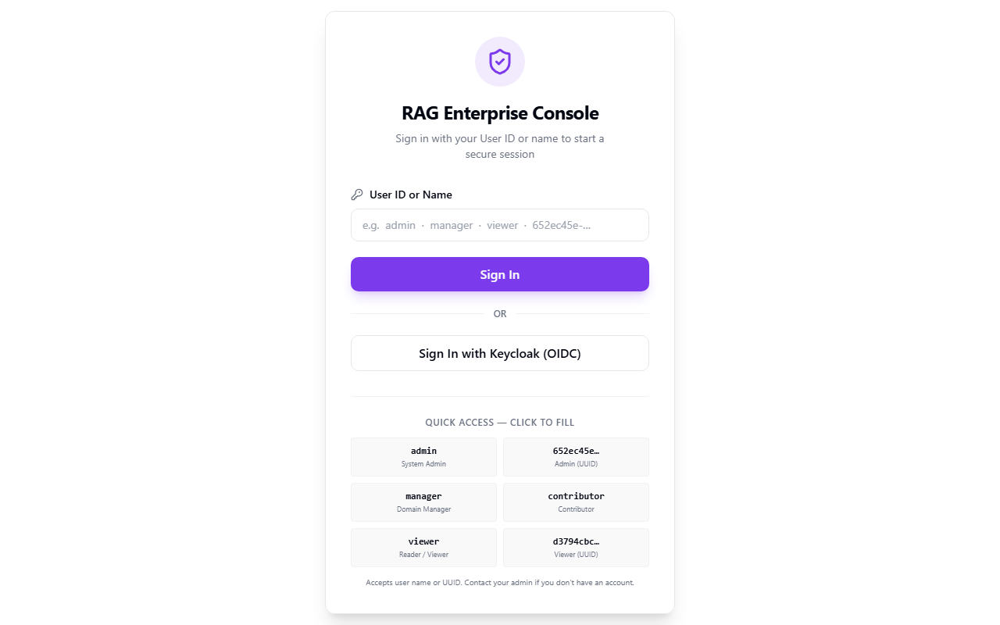
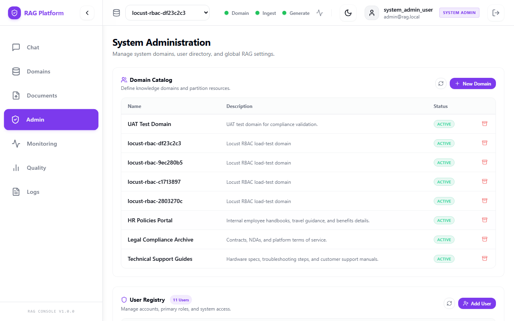
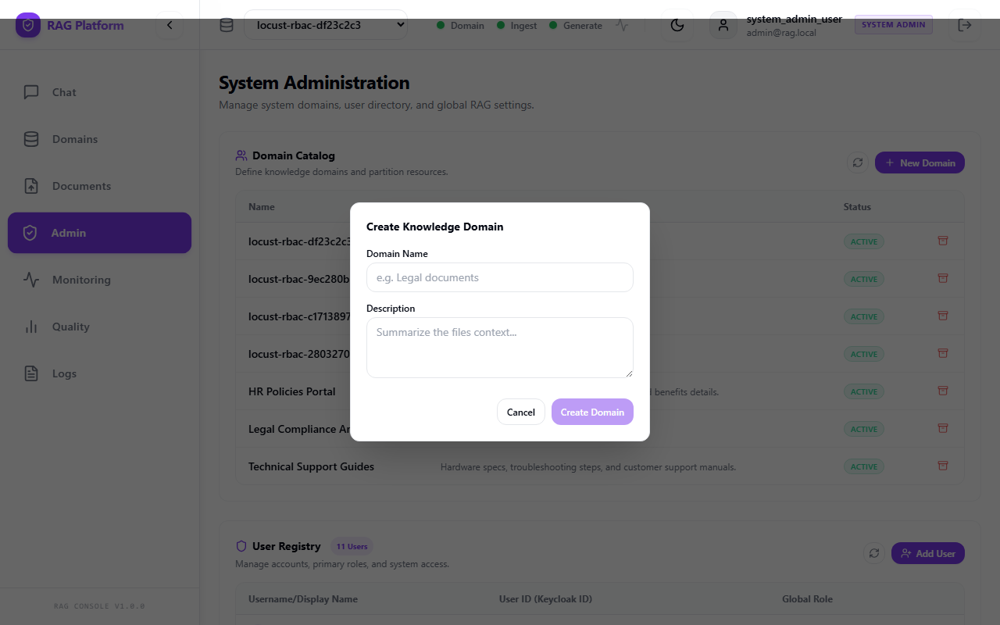
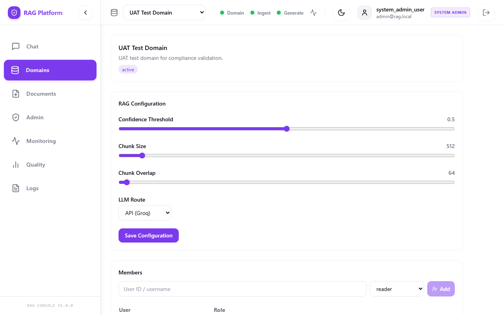
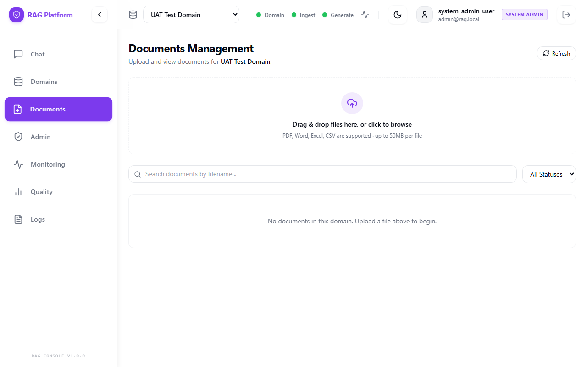
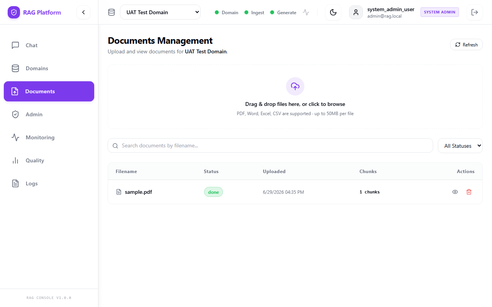
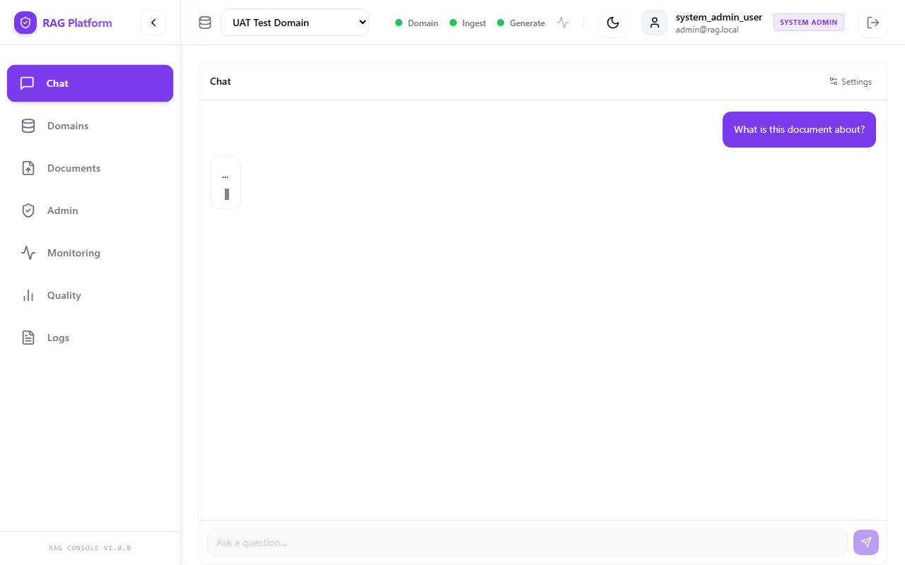
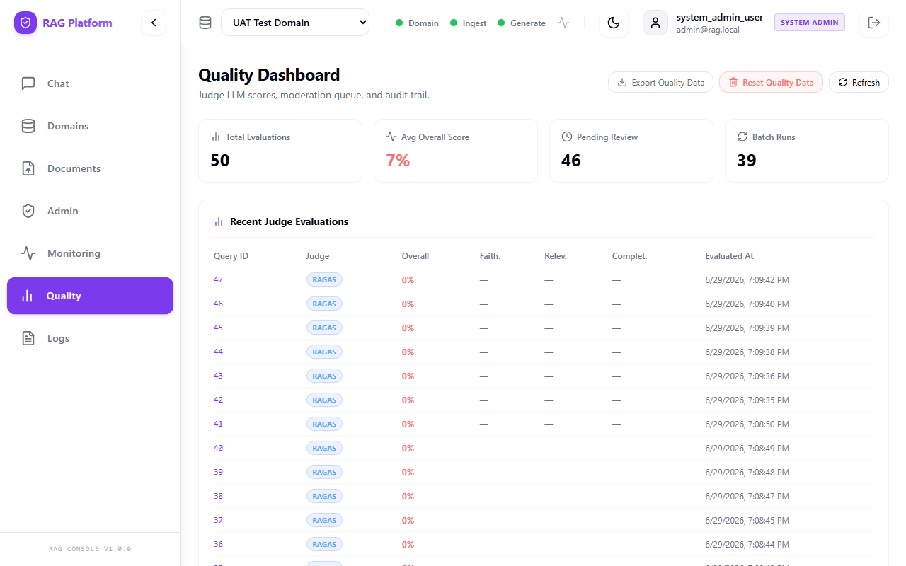

# RAG System User Guide

**Version:** 1.0  
**Last Updated:** June 2026  
**Application URL:** `https://localhost:3001`  
**API URL:** `https://localhost:8000`

## 1. What This System Does

The RAG system lets you upload documents into a knowledge domain and ask questions about those documents. It searches the selected domain, finds relevant passages, and generates an answer with citations.

The system answers from uploaded and processed documents. It does not browse the internet.

## 2. Roles

| Role | What You Can Do |
|---|---|
| Reader | View assigned domains and ask questions. |
| Contributor | Reader permissions plus upload documents. |
| Domain Admin | Contributor permissions plus manage members and domain settings. |
| System Admin | Manage all domains, users, and system-level settings. |

If a button or page is missing, your role may not include that permission.

## 3. Log In

1. Open `https://localhost:3001`.
2. Enter your user ID, such as `admin`, `test_reader`, or the ID assigned by your administrator.
3. Click **Login**.
4. Wait for the main app screen to load.

If login fails:

- Confirm the user ID is typed exactly.
- Ask an administrator to confirm your user exists.
- If your organization uses Keycloak, use the Keycloak login option instead of dev login.

## 4. Choose a Domain

A domain is an isolated knowledge space. Documents, users, and answers in one domain are separated from other domains.

1. Open the domain selector or Domains page.
2. Review the domains available to you.
3. Select the domain that contains the documents you want to use.

If a domain is missing, you are probably not assigned to it. Contact a domain administrator.

## 5. Create a Domain

Who can do this: domain administrators or system administrators, depending on configuration.

1. Open **Domains**.
2. Click **Create Domain**.
3. Enter a short, clear name, such as `HR Policies`.
4. Enter a description explaining what belongs in the domain.
5. Submit the form.
6. Confirm the new domain appears with status `active`.

Good domain names are specific. For example, use `Engineering Runbooks` instead of `Documents`.

## 6. Manage Members

Who can do this: domain administrators and system administrators.

1. Open the domain.
2. Open **Members** or the domain settings area.
3. Add the user ID.
4. Choose a role:
   - `reader` for question-only access.
   - `contributor` for upload access.
   - `domain_admin` for domain management.
5. Save the assignment.
6. Confirm the member appears in the member list.

Use the lowest role that lets the user do their job.

## 7. Upload a Document

Who can do this: contributors, domain administrators, and system administrators.

1. Open **Documents**.
2. Select the target domain.
3. Click **Upload Document**.
4. Choose a supported file:
   - PDF: `.pdf`
   - Word: `.docx`
   - CSV: `.csv`
   - Image: `.png`, `.jpg`, `.jpeg`
5. Confirm the file is under 50 MB.
6. Submit the upload.
7. Confirm the document appears with status `pending`.

Do not upload documents containing secrets, passwords, or sensitive personal data unless your organization has approved that use.

## 8. Understand Document Status

After upload, the worker processes the file before it can be searched.

| Status | Meaning | What To Do |
|---|---|---|
| `pending` | Upload was accepted and is waiting for worker processing. | Wait, then refresh. |
| `processing` | Text extraction, OCR, chunking, or indexing is running. | Wait for completion. |
| `done` | Document is indexed and ready for questions. | You can query it. |
| `failed` | Processing failed. | Read the error if visible or contact an admin. |

If a document stays pending for more than 10 minutes, the worker service may not be running.

## 9. Ask a Question

Who can do this: readers, contributors, domain administrators, and system administrators.

1. Open **Chat** or **Ask**.
2. Select the correct domain.
3. Type a specific question.
4. Submit the question.
5. Wait for the answer.
6. Read the answer and citations together.

Better questions:

- "What is the vacation approval process?"
- "Which documents mention invoice retention?"
- "Summarize the safety requirements for warehouse access."

Less useful questions:

- "Tell me everything."
- "What should I do?"
- "Is this good?"

## 10. Read Citations

Citations show where the answer came from.

| Citation Field | Meaning |
|---|---|
| Filename | Source document name. |
| Page | Page number when available. |
| Score | Retrieval relevance score. Higher usually means more relevant. |
| Snippet | Text passage used as evidence. |

How to use citations:

1. Read the top citation first.
2. Confirm the snippet supports the answer.
3. If the answer is important, open the original document and verify the surrounding section.
4. If citations do not support the answer, do not rely on it.

## 11. Quality Scores

Some deployments include an evaluation dashboard. It may show:

- Faithfulness: whether the answer is supported by the retrieved context.
- Relevance: whether the answer addresses the question.
- Completeness: whether the answer covers the expected details.
- Overall score: combined quality signal.

Low scores do not always mean the answer is wrong, but they should be reviewed.

## 12. Common Errors

| Message or Symptom | Meaning | What To Do |
|---|---|---|
| User not found | Your user ID does not exist. | Ask admin to create or map your user. |
| Unauthorized | Login expired or token invalid. | Log in again. |
| Forbidden | Your role does not allow the action. | Ask a domain admin if access is needed. |
| Unsupported file type | File extension or MIME type is not allowed. | Convert to PDF, DOCX, CSV, PNG, JPG, or JPEG. |
| File exceeds limit | File is over 50 MB. | Compress or split the file. |
| Domain not visible | You are not assigned to that domain. | Request membership. |
| No relevant documents found | Domain has no matching processed content. | Upload/process documents or ask a more specific question. |
| Retrieval timed out | Search took too long. | Try a shorter question or contact admin. |
| LLM unavailable | Model provider is unreachable or misconfigured. | Try later and report it. |
| Document stuck pending | Worker may be stopped. | Contact administrator. |

## 13. Best Practices

- Select the correct domain before asking.
- Ask one question at a time.
- Prefer specific questions over broad prompts.
- Verify important answers against citations.
- Upload clean, searchable files when possible.
- For scanned PDFs, use high-resolution scans.
- Keep duplicate documents out of the same domain.
- Report missing or wrong citations.

## 14. FAQ

### Can the system answer questions about topics not in my documents?

No. It is designed to answer from uploaded documents in the selected domain.

### How long does document processing take?

Small digital PDFs often process in seconds. Large PDFs, scanned documents, or OCR-heavy images can take several minutes.

### Can I ask questions in Arabic?

Yes, if the deployment has the required OCR and language model support configured. Results are usually best when the question language matches the document language.

### What happens if I upload the same document twice?

Each upload creates a separate document record. Duplicate content can cause duplicate citations.

### Can users in another domain see my documents?

No. Domains are isolated by membership and retrieval indexes.

### Why does an answer have no citations?

The system may have found no relevant chunks, or a service may have degraded. Treat uncited answers as unverified and report the case.

### Who should I contact for access changes?

Contact your domain administrator or system administrator.

